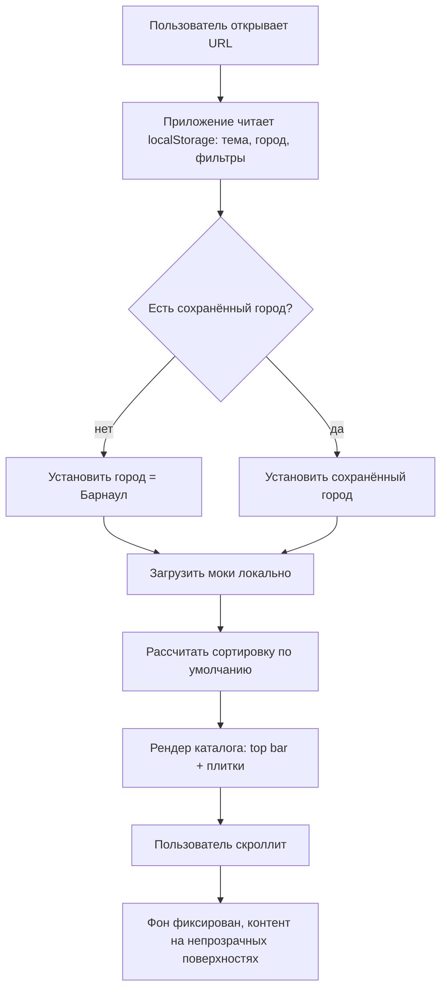
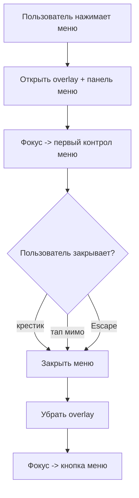
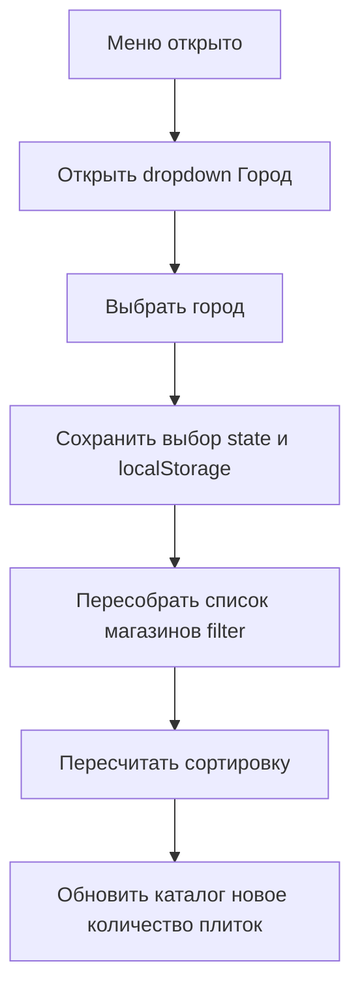
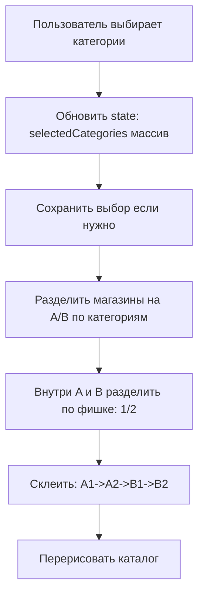
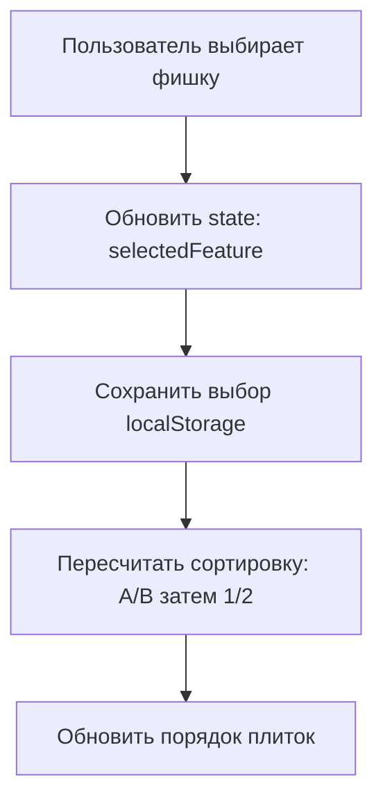
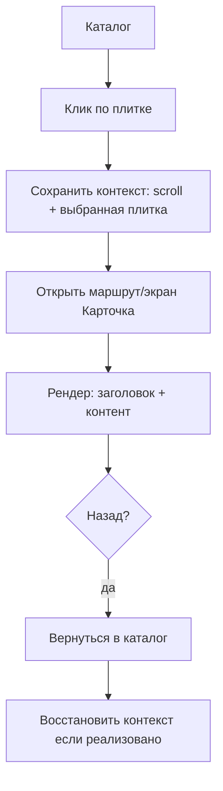
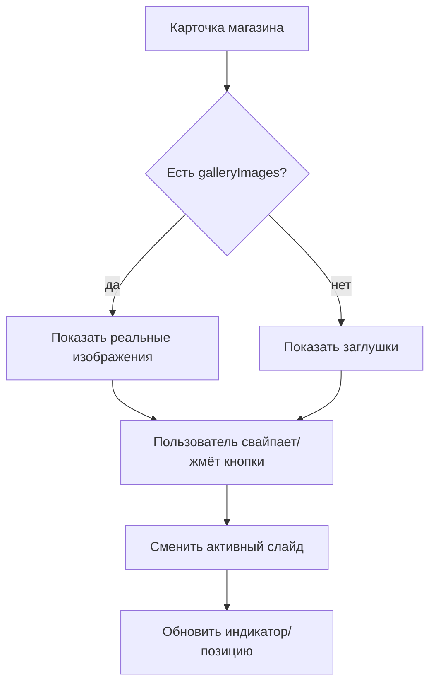
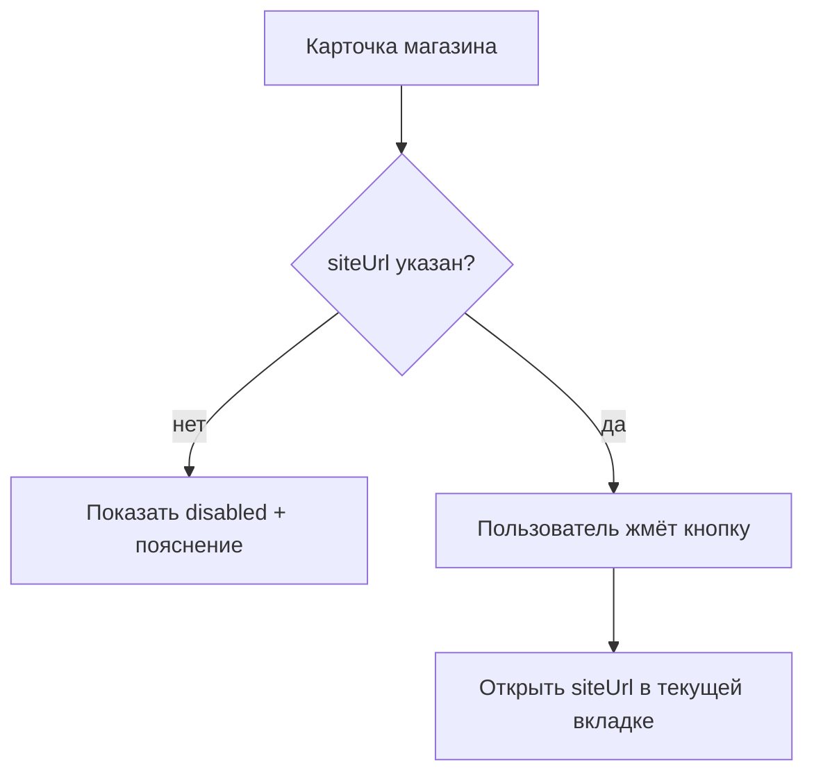
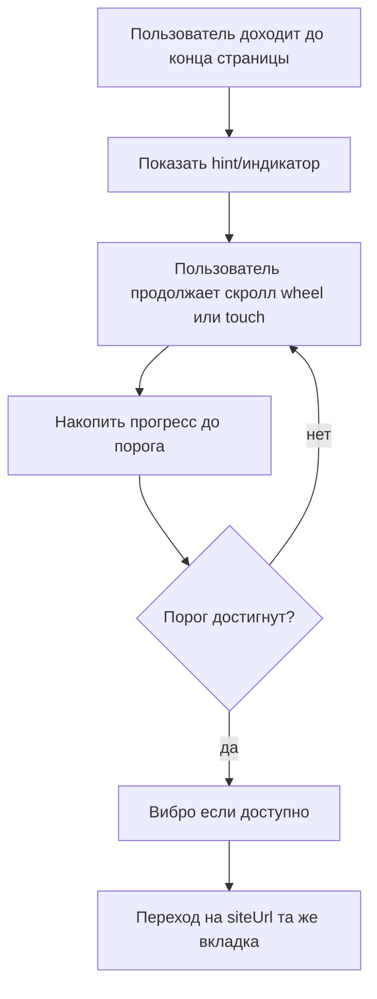
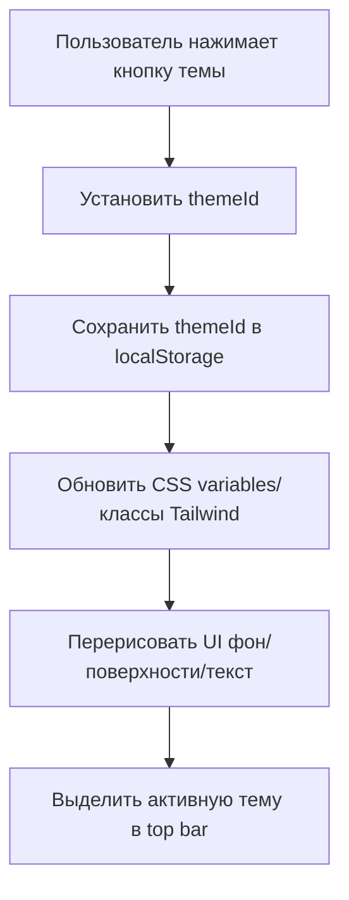

# Техническое задание (ТЗ)

Макет клиентского приложения «Автотека» — **v1.6 (синхронизировано:
требования + best practices)**  
Дата: **2026-03-02**

---

## 1. Цель

Сделать клиентский веб‑макет (SPA) каталога магазинов автозапчастей
для демонстрации бизнес‑заказчику.

- Без бэкенда: все данные замоканы/захардкожены.
- Метрики не собираем, пользовательские тесты пока не проводим.

## 2. Scope (что делаем)

Входит:

- Экран «Каталог магазинов» (плитки).
- Экран «Карточка магазина».
- Меню (гамбургер): выбор города, выбор категорий (мультивыбор), выбор
  фишки (одиночный выбор).
- Сортировка по категориям/фишке (строго по алгоритму).
- Переключение 6 тем (3 стиля × 2 палитры) + сохранение выбора.
- Переход на сайт магазина: кнопкой и через «доскролл вниз» с
  индикатором и вибро‑откликом (где доступно).

Не входит: админка/CRUD, API, загрузка пользовательских изображений.

## 3. Технологии и требования к коду

- Vue 3.5+ (Composition API, `<script setup>`).
- Tailwind CSS 4.1+.
- Цвета/палитры: только `oklch(...)` и `color-mix(in oklch, ...)`.
- Мок‑данные: pretty format (многострочный JSON/TS), удобно
  редактировать руками.

**Доп. требования к качеству кода (best practices):**

- Семантика: интерактивные элементы — `button`/`a`, а не `div` (для
  доступности и клавиатуры).
- Фокус‑менеджмент: видимый `:focus-visible`, восстановление фокуса
  после закрытия меню/диалогов.
- Без «магии брейкпоинтов» для интерактива: реакция hover должна
  зависеть от возможностей устройства (`hover/pointer`), а не от
  ширины экрана.

## 4. Брейкпоинты и адаптив

Tailwind screens:

- xs = 20rem (320px)
- sm = 24rem (384px)
- 3xl = 48rem (768px)
- 7xl = 80rem (1280px)

Приоритет: xs и sm. Дополнительно: 3xl (планшет), 7xl (десктоп).

## 5. Данные (моки)

### 5.1. Справочники

Категории: Отечественные, Китайски, Европейские, Японские, Корейские
запчасти.

Фишки: самая быстрая доставка (по умолчанию), акции, круглосуточно.

Города: Барнаул (по умолчанию), Нижний Новгород, Горно‑Алтайск.

### 5.2. Распределение магазинов по городам

- Барнаул: 17
- Нижний Новгород: 3
- Горно‑Алтайск: 9

### 5.3. Модель магазина (минимум)

- `id`, `name`, `city`, `categories[]`, `features[]`
- `workHours` (с переносами строк), `description`
- `contacts[{type,value}]`, `siteUrl`
- `thumbUrl?` (миниатюра), `galleryImages?` (изображения)
- `gallery?` (заглушки, если нет `galleryImages`)

### 5.4. Генерация изображений для моков

- Для ~половины магазинов используются сгенерированные изображения.
- Соотношения: 1:1, 2:3, 3:2.
- Размеры: 0.5× … 1.5×, шаг 0.25× (0.5/0.75/1.0/1.25/1.5).
- Хранение: `public/generated/…`; в моках пути
  `/generated/<file>.png`.
- В каталоге: `thumbUrl` опционально в плитке; в карточке:
  `galleryImages`, иначе заглушки.

**Best practices для изображений (не меняют факты, задают целевое
качество):**

- Для карточек/плиток предусмотреть резервирование места (через
  `aspect-ratio`) чтобы избежать CLS.
- Включить `loading="lazy"` для изображений ниже первого экрана;
  использовать `srcset/sizes` (если реализуемо в рамках макета).

## 6. Темы/стили и фон

6 тем = 3 стиля × 2 палитры (Neutral/Accent).

- A — «Чистый каталог + чипсы»
- B — «Тёмный + стекло»
- C — «Двухпанельный (по настроению)»

Переключение тем: 6 кнопок в sticky top bar, активная тема выделена,
сохранение в `localStorage`.

Фон: по стилям, тайловый, как WhatsApp; фиксирован при скролле;
обязателен всегда; не просвечивает через контент.

## 7. Общие правила UI/UX

### 7.1. Непрозрачные поверхности

Любой текст/контент поверх пёстрого фона размещается на непрозрачной
подложке (`surface`/`surface-strong`).

### 7.2. Hover/tap и bounce

- Все кликабельные элементы имеют реакцию: светлые темы — темнее,
  тёмные — светлее.
- Кнопки используют тот же bounce, что и плитки; bounce усилен ≈×2.
- На устройствах без hover эффект заметен на tap.
- Hover работает на всех брейкпоинтах, включая случаи, когда эмуляция
  ограничивает CSS `:hover`.

**Уточнение (best practice, чтобы не «ломать» hover на маленьких
экранах/планшетах):**

- Интерактивные состояния не привязывать к ширине (`xs/sm/3xl`), а
  определять по возможностям ввода:
  - hover показывать при `(hover: hover) and (pointer: fine)`;
  - для touch — обязательно `active`/pressed‑состояние и bounce.

### 7.3. Анимации

Анимации для меню, dropdown, смены темы, интерактивных состояний и
индикатора доскролла (длительности как в текущей реализации).

### 7.4. Доступность (Accessibility, целевые требования)

- Базовый уровень: WCAG 2.1 AA (в рамках макета — ключевые пункты
  ниже).
- Видимый `focus` для всех интерактивных элементов (использовать
  `:focus-visible`).
- Меню (гамбургер) открывается/закрывается с клавиатуры (Enter/Space;
  Escape для закрытия), фокус не «теряется».
- Контраст текста на поверхностях — не ниже 4.5:1 для обычного текста
  (целевое требование).
- Изображения имеют `alt` (если декоративное — пустой alt).

### 7.5. Производительность и стабильность (Core Web Vitals, lab‑проверка)

- Метрики в проде не собираем (как в разделе 1), но для качества
  интерфейса используем lab‑проверку (Lighthouse/DevTools, mobile
  throttling).
- Целевые значения (ориентир «Good»): **LCP ≤ 2.5s**, **CLS ≤ 0.1**,
  **INP ≤ 200ms** на типовом mobile‑профиле.
- Не допускать визуальных скачков: резервировать место под изображения
  и динамические блоки (`aspect-ratio`/фикс. высота, skeleton).

### 7.6. Адаптивность и управление касанием

- Минимальный размер тач‑таргетов: **48×48 CSS px**; расстояние между
  близкими targets — не менее 8px.
- Без горизонтального скролла на xs/sm; текст и элементы управления
  читаемы без зума.
- Учитывать `safe-area` (iOS) для sticky top bar и элементов у краев
  экрана.

### 7.7. Обратная связь, состояния и ошибки

- Состояния элементов: hover/active/focus/disabled (на touch —
  обязательно active).
- Любое действие даёт мгновенную обратную связь
  (pressed/bounce/loader), без «пустых» экранов.
- Если действие недоступно (нет `siteUrl`, нет контактов) —
  disabled‑состояние + пояснение (а не «битая» ссылка).

### 7.8. Уважение системных настроек (motion)

- Поддержать `prefers-reduced-motion`: уменьшать/отключать интенсивные
  анимации, оставляя функциональную обратную связь.

### 7.9. Требование соответствия чек‑листу

- Перед сдачей версии заполняется чек‑лист (раздел 14). Все пункты
  **MUST** должны быть выполнены; по пунктам **SHOULD** допускаются
  исключения, если они задокументированы.

## 8. Логика сортировки

Город — фильтр. Категории и фишка — только сортировка.

Алгоритм: **A/B по категориям → A1/A2/B1/B2 по фишке → склейка A1, A2,
B1, B2**. Порядок внутри подмассивов не важен.

**Требования к реализации (чтобы исключить расхождения):**

- A: магазины, у которых есть хотя бы одна из выбранных категорий.
- B: остальные.
- 1: магазины, у которых есть выбранная фишка.
- 2: остальные.
- Итоговый порядок: A1 → A2 → B1 → B2.

## 9. Экран: Каталог магазинов

- Заголовок/город/количество — на непрозрачной панели.
- Сетка: xs/sm — 2 в ряд (xs gap меньше, sm gap больше); 3xl — 3; 7xl
  — 4; на больших экранах контейнер ограничен по ширине; gap на
  3xl/7xl заметно больше.
- Плитка: монотонный фон + орнамент + название на непрозрачной плашке;
  display‑шрифт зависит от стиля; текст с обводкой; `thumbUrl`
  показывается опционально.
- Клик по плитке → карточка магазина.

**Доп. требования (best practices):**

- Плитка должна быть доступной кликабельной сущностью (`button`/`a`):
  роль, доступное имя, `focus-visible`.
- Длинные названия: перенос/ellipsis, чтобы не ломать сетку.

## 10. Экран: Меню (гамбургер)

- Открытие: «≡» в top bar.
- Закрытие: крестик или клик/тап мимо панели.
- Город (dropdown, один выбран всегда) — фильтр.
- Категории (мультивыбор) — сортировка.
- Фишка (dropdown, одиночный выбор) — сортировка; клик мимо закрывает
  список.

**Доп. требования (best practices):**

- При открытии меню: фокус переводится внутрь меню (на
  заголовок/первый контрол), фон страницы под меню не должен
  скроллиться (или скролл должен быть контролируемым).
- При закрытии меню: фокус возвращается на кнопку «≡».
- Закрытие по `Escape` (клавиатура).
- Для dropdown: корректные роли/aria (минимум `aria-expanded`,
  `aria-controls`).

## 11. Экран: Карточка магазина

- Кнопка «Назад» + название на непрозрачной панели.
- Галерея: свайп/кнопки; `galleryImages` (если есть) иначе заглушки;
  на 3xl/7xl высота ~в 1.5 раза меньше (через иной aspect).
- Режим работы — оверлей на непрозрачной плашке.
- Описание/контакты — карточки на непрозрачных поверхностях; контакты
  кликабельны (`tel:`/`mailto:`/ссылки).
- Переход на сайт: кнопка (в этой вкладке) + «доскролл вниз» с
  индикатором и вибро‑откликом.

**Доп. требования (best practices):**

- Свайп галереи не должен конфликтовать со скроллом страницы; есть
  понятные кнопки «влево/вправо» как альтернатива.
- При открытии внешнего сайта в той же вкладке: явно пометить действие
  (например, иконка внешней ссылки/подпись «Откроется сайт магазина»).
- «Доскролл вниз»: обязательно работает на **touch и wheel** на всех
  брейкпоинтах; индикатор состояния виден; повторный триггер защищён
  от случайных срабатываний (debounce).
- Вибрация: короткий отклик (например 10–30ms), только если
  поддерживается и пользователь не отключил.

## 12. Use cases (реализованные сценарии) — подробно

Ниже — пошаговые сценарии. Они **не меняют факты** текущей реализации,
а уточняют требования к UI/UX так, чтобы соответствовать best
practices.

### UC-01. Запуск приложения и отображение каталога по умолчанию

**Цель:** Показать каталог магазинов с дефолтными настройками (город
Барнаул, фишка по умолчанию).

**Предусловия:**

- Открытие приложения в браузере (xs/sm приоритет; 3xl/7xl
  дополнительно).
- Данные доступны локально из моков; сети/бэкенда нет.

**Основной сценарий (шаги):**

1. Открыть приложение по URL.
2. Дождаться первой отрисовки каталога.
3. Убедиться, что выбран город по умолчанию: «Барнаул» (если ранее не
   выбран другой).
4. Прокрутить список плиток вниз/вверх и проверить стабильность
   фона/контента.

**Ожидаемый результат:**

- Отображается экран «Каталог магазинов» с top bar и кнопкой меню.
- Отображается **17** плиток магазинов для Барнаула.
- Фон фиксирован и не просвечивает через контент; текст на
  непрозрачных поверхностях.

**Требования качества (best practices):**

- Без визуальных скачков (CLS): изображения/заглушки не смещают
  плитки.
- Все интерактивные элементы имеют `focus-visible` и доступны с
  клавиатуры.
- На слабых устройствах не должно быть «белых экранов» при первом
  рендере (показывать скелетон/плавный переход, если нужно).

**Диаграмма:**

### UC-02. Открыть и закрыть меню (гамбургер)

**Цель:** Открыть боковое меню, взаимодействовать с контролами и
корректно закрыть.

**Предусловия:**

- На экране каталога или карточки магазина.

**Основной сценарий (шаги):**

1. Нажать кнопку «≡» в top bar.
2. Проверить, что меню открыто и элементы управления доступны.
3. Закрыть меню крестиком.
4. Открыть меню снова и закрыть кликом/тапом мимо панели.
5. Открыть меню снова и закрыть клавишей Escape (если клавиатура
   доступна).

**Ожидаемый результат:**

- Меню открывается поверх контента, закрывается всеми указанными
  способами.
- После закрытия фокус возвращается на кнопку «≡».

**Требования качества (best practices):**

- Фокус не теряется: при открытии переводится в меню; при закрытии
  возвращается назад.
- Клик/тап мимо панели закрывает меню без случайных кликов по контенту
  под ним (использовать overlay).
- Нет фонового скролла под открытым меню (или он контролируемый).

**Диаграмма:**

### UC-03. Выбор города (фильтрация списка)

**Цель:** Изменить город и получить список магазинов выбранного
города.

**Предусловия:**

- Меню открыто.

**Основной сценарий (шаги):**

1. Открыть dropdown «Город».
2. Выбрать «Нижний Новгород».
3. Закрыть меню.
4. Проверить количество магазинов в каталоге.
5. Повторить для «Горно‑Алтайск».

**Ожидаемый результат:**

- После выбора города каталог показывает магазины только выбранного
  города.
- Для Нижнего Новгорода отображается **3** магазина; для
  Горно‑Алтайска — **9**.
- Выбор города сохраняется (после перезагрузки остаётся выбранным).

**Требования качества (best practices):**

- Dropdown закрывается при клике/тапе мимо; `aria-expanded` корректен.
- Изменение города не должно сбрасывать выбранные категории/фишку,
  если не оговорено иначе (сохраняем состояние сортировки).

**Диаграмма:**

### UC-04. Выбор категорий (мультивыбор, сортировка)

**Цель:** Выбрать одну/несколько категорий и убедиться, что меняется
порядок плиток по алгоритму.

**Предусловия:**

- Меню открыто, выбран любой город.

**Основной сценарий (шаги):**

1. Отметить одну категорию (например «Европейские»).
2. Закрыть меню и зафиксировать порядок первых N плиток.
3. Открыть меню и добавить вторую категорию (например «Японские»).
4. Закрыть меню и убедиться, что порядок пересчитан.
5. Снять все категории и убедиться, что список возвращается к базовому
   порядку (с учётом выбранной фишки).

**Ожидаемый результат:**

- Категории не фильтруют магазины, а влияют только на сортировку
  (A/B).
- Порядок соответствует правилу A1→A2→B1→B2 (раздел 8).

**Требования качества (best practices):**

- Мультивыбор визуально однозначен (checked state, достаточный
  контраст).
- Тач‑таргеты чекбоксов/чипов ≥ 48×48; расстояние ≥ 8px.

**Диаграмма:**

### UC-05. Выбор фишки (одиночный выбор, сортировка)

**Цель:** Выбрать фишку и убедиться, что меняется порядок плиток по
алгоритму.

**Предусловия:**

- Меню открыто, выбран любой город.

**Основной сценарий (шаги):**

1. Открыть dropdown «Фишка».
2. Выбрать «Акции» (или «Круглосуточно»).
3. Закрыть меню и проверить, что порядок плиток изменился (при прочих
   равных).
4. Открыть меню, выбрать «самая быстрая доставка» и убедиться, что
   сортировка пересчитана.

**Ожидаемый результат:**

- Фишка не фильтрует магазины, а влияет на сортировку (1/2 внутри A и
  B).
- Всегда выбран ровно один вариант фишки (есть дефолт).

**Требования качества (best practices):**

- Dropdown закрывается при клике/тапе мимо; есть визуальное выделение
  текущего выбора.
- Фишка по умолчанию применяется на старте, если пользователь не
  выбирал другую.

**Диаграмма:**

### UC-06. Открытие карточки магазина из каталога

**Цель:** Перейти из каталога в карточку конкретного магазина.

**Предусловия:**

- Пользователь на экране каталога.

**Основной сценарий (шаги):**

1. Нажать на плитку магазина.
2. Дождаться открытия экрана карточки магазина.
3. Нажать «Назад» и вернуться в каталог.

**Ожидаемый результат:**

- Открывается карточка выбранного магазина с названием, галереей,
  режимом работы, описанием и контактами.
- Кнопка «Назад» возвращает в каталог (с сохранением выбранных
  фильтров/сортировки и позиции скролла — целевое поведение, если
  реализуемо).

**Требования качества (best practices):**

- Переход не должен вызывать заметных лагов; при необходимости —
  skeleton для контента карточки.
- Фокус после перехода: на заголовок/первый элемент карточки; после
  «Назад» — на плитку, с которой ушли (если реализуемо).

**Диаграмма:**

### UC-07. Просмотр галереи в карточке магазина

**Цель:** Просмотреть изображения магазина через свайп и/или кнопки.

**Предусловия:**

- Открыта карточка магазина.
- У магазина есть `galleryImages` или будут показаны заглушки.

**Основной сценарий (шаги):**

1. Перелистнуть изображения свайпом влево/вправо.
2. Перелистнуть изображения кнопками (если есть).
3. Убедиться, что на разных брейкпоинтах галерея имеет корректный
   aspect и высоту (на 3xl/7xl ниже).

**Ожидаемый результат:**

- Галерея листается, не ломая скролл страницы.
- Если нет изображений — показаны заглушки, визуально согласованные со
  стилем темы.

**Требования качества (best practices):**

- Есть альтернативный способ навигации кроме свайпа (кнопки) — для
  доступности.
- Изображения/заглушки не вызывают CLS (зарезервированная
  высота/aspect).

**Диаграмма:**

### UC-08. Переход на сайт магазина кнопкой

**Цель:** Перейти на внешний сайт магазина из карточки (в этой
вкладке).

**Предусловия:**

- Открыта карточка магазина.
- У магазина указан `siteUrl`.

**Основной сценарий (шаги):**

1. Нажать кнопку «Перейти на сайт».

**Ожидаемый результат:**

- Открывается сайт магазина **в этой вкладке**.

**Требования качества (best practices):**

- Кнопка имеет понятную подпись и (желательно) маркер внешнего
  перехода.
- Если `siteUrl` отсутствует — кнопка disabled + пояснение.

**Диаграмма:**

### UC-09. Переход на сайт через «доскролл вниз»

**Цель:** Триггернуть переход на сайт продолжением
скролла/потягиванием в конце страницы.

**Предусловия:**

- Открыта карточка магазина.
- У магазина указан `siteUrl`.

**Основной сценарий (шаги):**

1. Прокрутить страницу до самого конца.
2. Продолжить скролл колёсиком (wheel) или потянуть вниз (touch) до
   срабатывания триггера.
3. Наблюдать индикатор прогресса/состояния и (если поддерживается)
   вибро‑отклик.

**Ожидаемый результат:**

- Показывается индикатор, отражающий «дотягивание» до порога.
- При достижении порога выполняется переход на `siteUrl` в текущей
  вкладке.
- Сценарий работает на touch и wheel, на всех брейкпоинтах.

**Требования качества (best practices):**

- Защита от случайного срабатывания: требуется осознанное
  «дотягивание» (порог + удержание/время), после срабатывания —
  cooldown.

- Индикатор доступен по контрасту и не перекрывает важный контент.

**Диаграмма:**

### UC-10. Переключение темы (6 вариантов) и сохранение

**Цель:** Переключить тему/палитру и убедиться, что выбор сохраняется.

**Предусловия:**

- Пользователь на любом экране (каталог/карточка).

**Основной сценарий (шаги):**

1. В sticky top bar нажать на одну из 6 кнопок темы.
2. Убедиться, что тема применена ко всем поверхностям/тексту/фону.
3. Перезагрузить страницу и убедиться, что выбранная тема сохранилась.

**Ожидаемый результат:**

- Активная тема визуально выделена.
- Тема применяется мгновенно (без заметного мерцания) и сохраняется в
  `localStorage`.

**Требования качества (best practices):**

- Контраст текста на поверхностях сохраняется (цель WCAG AA).
- При `prefers-reduced-motion` анимация смены темы упрощается.

**Диаграмма:**

## 13. Критерии приёмки

- Фон по стилям отображается всегда и не просвечивает через контент.
- 29 магазинов (17/3/9) в моках.
- Сортировка соответствует алгоритму A1/A2/B1/B2.
- Все кликабельные элементы имеют hover/tap‑реакцию и bounce.
- 6 тем переключаются и сохраняются; активная тема выделена.
- В ~половине магазинов есть реальные изображения (thumb + галерея) по
  правилам генерации.
- Доскролл‑переход работает (touch и wheel), показывает индикатор,
  делает переход.

**Доп. критерии качества (best practices):**

- Пройдены MUST‑пункты чек‑листа (раздел 14).
- Меню и ключевые сценарии доступны с клавиатуры; видимый focus.
- Нет горизонтального скролла на xs/sm; тач‑таргеты ≥ 48×48.
- Lab‑проверка (Lighthouse/DevTools) показывает целевые ориентиры по
  LCP/CLS/INP без критических регрессий.

## 14. Чек‑лист соответствия UI/UX best practices

Формат: **MUST** — обязательно для приёмки; **SHOULD** — желательно
(допустимы исключения с комментарием).

### MUST. Навигация и семантика

- [ ] Все интерактивные элементы — `button`/`a`, не `div`.
- [ ] Видимый `:focus-visible` на всех интерактивных элементах.
- [ ] Меню: открытие/закрытие с клавиатуры; закрытие по Escape; фокус
      возвращается на «≡».
- [ ] Клик/тап по плитке/кнопкам всегда даёт feedback
      (pressed/bounce).

### MUST. Адаптив и ввод

- [ ] Нет горизонтального скролла на xs/sm.
- [ ] Тач‑таргеты ≥ 48×48 CSS px, расстояние ≥ 8px.
- [ ] Hover не отключается из‑за ширины экрана; определяется по
      hover/pointer возможностям.

### MUST. Читаемость и контраст

- [ ] Текст на пёстром фоне всегда на непрозрачной поверхности.
- [ ] Контраст текста на основных поверхностях не ниже целевого уровня
      (WCAG AA ориентир).

### MUST. Стабильность раскладки

- [ ] Изображения/галерея не вызывают CLS (зарезервированная
      высота/aspect).
- [ ] Нет заметного «прыганья» контента при смене темы/открытии
      меню/загрузке изображений.

### MUST. Ключевые сценарии

- [ ] UC-01…UC-10 выполняются согласно описанию; «доскролл вниз»
      работает на touch и wheel на всех брейкпоинтах.
- [ ] Если `siteUrl` отсутствует — переход недоступен и это понятно
      пользователю.

### SHOULD. Производительность (lab)

- [ ] Lighthouse mobile: нет критических проблем, ориентиры
      LCP/CLS/INP в зоне «Good» или близко.
- [ ] Lazy loading изображений ниже первого экрана.

### SHOULD. Доступность (расширенная)

- [ ] У dropdown корректные aria-атрибуты (`aria-expanded`,
      `aria-controls`).
- [ ] Alt‑тексты у изображений; декоративные — пустой alt.

### SHOULD. Motion

- [ ] При `prefers-reduced-motion` анимации упрощены/уменьшены.
