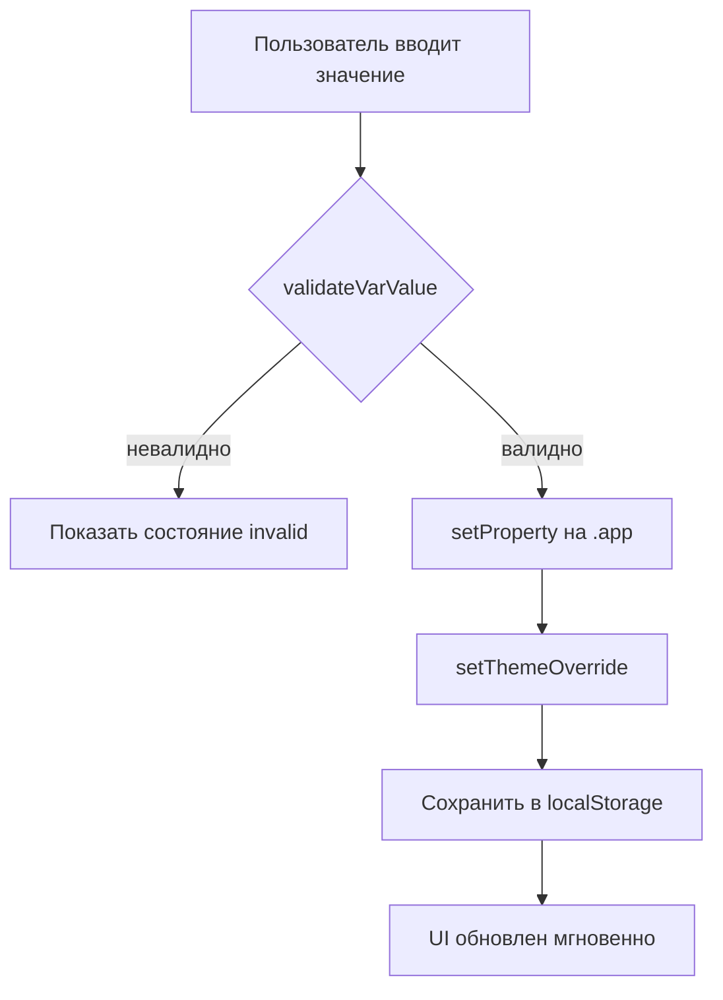
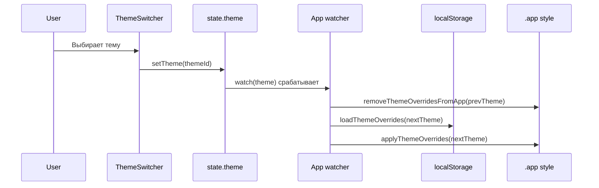

# Документация по реализации (по коду)

**Дата актуализации: 2026-03-03.** Документ предназначен для
использования, сопровождения и дальнейшего развития макета.

---

## 1. Сущности и компоненты

### 1.1. Сущности (модели данных)

#### City

Файл: `frontend/src/mocks/dicts.json`

- `code: string` — ключ (используется в `shop.cityCode` и
  `state.cityCode`)
- `name: string` — отображаемое имя
- `isDefault?: boolean` — какой город выбирать при первом запуске

**Влияние:** фильтрация каталога.

#### Category / Feature

Файл: `frontend/src/mocks/dicts.json`

- `categories: string[]`
- `features: string[]`

**Влияние:** только сортировка (не фильтрация).  
**Важно:** совпадение по строкам, без нормализации.

#### Theme

Файл: `frontend/src/mocks/dicts.json`, CSS:
`frontend/src/styles/themes.css`

- `id: string` → класс `.theme-<id>`
- `label: string` → текст в UI
- `style/palette/icon` → мета‑инфо для UI

**Влияние:** набор CSS‑переменных. Значение темы сохраняется в
`localStorage`.

#### Shop

Файлы: `frontend/src/mocks/shops.json`, тип:
`frontend/src/types/shop.ts`

Ключевые поля (фактическое использование):

- `code, name, cityCode`
- `categoryCodes: string[]`, `featureCodes: string[]`
- `workHours: string`, `description: string`
- `contacts: Array<{type:string;value:string}>`
- `siteUrl: string`
- `thumbUrl?: string`
- `galleryImages?: string[]` — если непусто, включается карусель

---

### 1.2. Компоненты (Vue)

#### `TopBar.vue`

- фиксированная верхняя панель
- кнопка открытия меню
- `ThemeSwitcher`

#### `HamburgerMenu.vue`

- overlay + панель
- закрытие: overlay/крестик/Escape
- возврат фокуса на исходный элемент
- внутри: `CitySelect`, `CategoryChips`, `FeatureSelect`

#### `CitySelect.vue`

- `<select>` города
- `setCity(cityCode)` обновляет `state.cityCode`
- значение сохраняется в `localStorage` (ключ `autoteka_city`)

#### `CategoryChips.vue`

- кнопки‑чипсы
- `toggleCategory(cat)` обновляет `state.selectedCategories`
- влияет на сортировку
- список выбранных категорий сохраняется в `localStorage`
  (`autoteka_categories`)

#### `FeatureSelect.vue`

- кастомный dropdown
- `setFeature(feature)` обновляет `state.selectedFeature`
- влияет на сортировку
- выбранная фишка сохраняется в `localStorage` (`autoteka_feature`)

#### `ShopTile.vue`

- плитка магазина (квадрат)
- `thumbUrl` опционален, иначе декоративный градиент
- `loading="lazy"`/`decoding="async"` для изображений

#### `GalleryCarousel.vue`

- поддерживает `items` как `string[]` (URL) или как объектные элементы
- свайп (pointer events), prev/next
- использует параметры из `frontend/src/config/ui.ts`

#### `OverscrollOpenLink.vue`

- переход на внешний URL, если пользователь «дотянул вниз» в конце
  страницы
- работает для touch и wheel
- использует параметры из `frontend/src/config/ui.ts`

---

## 2. Сигнатуры функций/методов и формат данных

### 2.1. Глобальное состояние

Файл: `frontend/src/state.ts`

- `state.theme: ThemeId`
- `state.menuOpen: boolean`
- `state.cityCode: string`
- `state.selectedCategoryCodes: string[]`
- `state.selectedFeatureCode: string`

Методы:

- `setTheme(themeId)`
- `setCity(cityCode)`
- `toggleCategory(categoryCode)`
- `setFeature(featureCode)`

Сохранение:

- `autoteka_theme`
- `autoteka_city`
- `autoteka_categories`
- `autoteka_feature`

При чтении применяются проверки и fallback:

- `sanitizeTheme`
- `sanitizeCity`
- `sanitizeCategories`
- `sanitizeFeature`

### 2.2. Сортировка

Файл: `frontend/src/utils/sortShops.ts`

```ts
sortShopsByRules({
  shops,
  selectedCategoryCodes,
  selectedFeatureCode
}) => Shop[]
```

Правила:

- A = есть выбранная категория
- B = иначе
- 1 = есть выбранная фишка
- 2 = иначе
- итог: A1 → A2 → B1 → B2

### 2.3. Storage helpers

Файл: `frontend/src/utils/storage.ts`

- `loadLocal(key, fallback)`
- `saveLocal(key, value)`

---

## 3. Use cases (фактические)

1. Открыть приложение → каталог выбранного по умолчанию города.
2. Открыть/закрыть меню (overlay/крестик/Escape) → фокус возвращается.
3. Выбрать город → фильтруется каталог и сохраняется после
   перезагрузки.
4. Выбрать категории/фишку → меняется порядок плиток по алгоритму и
   сохраняется после перезагрузки.
5. Открыть магазин → `/shop/:code`.
6. В карточке: кнопка «Перейти на сайт» → переход.
7. В карточке: «доскролл вниз» → переход (touch/wheel).
8. Переключить тему → сохраняется и восстанавливается из
   `localStorage`.

---

## 4. Страницы и возможности

### `/` Каталог

- список магазинов выбранного города
- сортировка по выбранным категориям/фишке
- переход в карточку магазина

### `/shop/:code` Карточка магазина

- название, режим работы, описание
- галерея (если есть `galleryImages`)
- контакты (часть кликабельна)
- переход на сайт кнопкой и overscroll

---

## 5. Настройки без правки «системной/бизнес логики»

### 5.1. Мок‑данные

- `frontend/src/mocks/dicts.json`
- `frontend/src/mocks/shops.json`

### 5.2. Темизация и UI‑тюнинг через CSS‑переменные

Где настраивать:

- `frontend/src/styles/themes.css` — **токены темы** (цвета, радиусы,
  тени, интерактив, обои)
- `frontend/src/styles/tailwind.css` — **UI‑примитивы**, которые
  читают эти токены через `var(--*)`

> Механика: класс темы вида `.theme-<id>` навешивается на корневой
> контейнер `.app`.  
> Если для темы не задан какой‑то токен, он возьмётся из `:root` в
> `themes.css`.

#### 5.2.1. Цветовые токены (читабельность и контраст)

- `--bg` — базовый фон под «обоями» (`.app-pattern`).
  - **Больше (L выше)** → светлее; меньше → темнее.
  - **Риск:** если сделать слишком близко к
    `--surface/--surface-strong`, панели «слипаются» с фоном.
  - **Если не задан/битый** → возьмётся дефолт из `:root`; если
    значение невалидно — браузер может отбросить свойство (фон станет
    `transparent`/`initial`), и визуально «поплывёт» контраст.

- `--surface` — базовая поверхность кнопок/интерактива.
  - **Слишком светлая/тёмная** относительно `--text` → падает контраст
    текста/иконок.
  - **Если сделать близко к `--surface-strong`** → исчезает иерархия
    «карточка vs кнопка».

- `--surface-strong` — «тяжёлая» поверхность панелей (`.text-panel`)
  на пёстром фоне.
  - **Чем ближе к `--bg`** → тем сильнее «просвечивает» визуальный шум
    обоев.
  - **Риск:** если поставить полупрозрачность/альфу (или сделать очень
    близкий по тону цвет), текстовые блоки будут хуже читаться на фоне
    обоев.

- `--text` — основной цвет текста.
  - **Слишком тёмный на тёмной поверхности / слишком светлый на
    светлой** → текст перестаёт читаться.
  - **Риск:** этот токен используется почти везде; ошибка приводит к
    «сломавшемуся» интерфейсу целиком.

- `--muted` — второстепенный текст/подписи.
  - **Ближе к `--text`** → второстепенные элементы становятся «слишком
    важными».
  - **Слишком бледный** → подписи и подсказки теряются.

- `--accent` — акцент (основные кнопки, активные элементы, focus‑ring
  вычисляется из него).
  - **Более насыщенный/яркий** → сильнее «перетягивает» внимание.
  - **Риск:** слишком яркий accent даёт агрессивный `--focus` и может
    ухудшить восприятие; слишком близкий к `--surface` делает
    primary‑кнопки «не отличимыми».

#### 5.2.2. Геометрия и глубина

- `--radius` — скругление карточек/панелей/кнопок
  (`rounded-[var(--radius)]`).
  - **Больше** → более «пухлый» UI; риск: на маленьких элементах
    скругление станет визуально как pill.
  - **Меньше** → более «строгий» UI; риск: может конфликтовать со
    стилем обоев/паттернов.

- `--shadow` — тень у панелей (`box-shadow: var(--shadow)`).
  - **Сильнее/размытие больше** → «глубже», но риск «грязи» и ощущение
    тяжести.
  - **Слабее/нет** → плоско; на пёстром фоне панели могут сливаться.

#### 5.2.3. Типографика

- `--font-display` — шрифт для заголовков/названий (используется в
  `ShopTile` и заголовке магазина).
  - **Смена на моно/сериф** резко меняет характер интерфейса.
  - **Риск:** экзотические шрифты могут ухудшить читабельность,
    особенно на маленьких размерах.

#### 5.2.4. Токены плитки (визуальный «штамп» карточек)

- `--tile-stroke` — обводка текста (`-webkit-text-stroke`) у
  `.stroke-title`.
  - **Больше контраст/темнее** → текст «вырезается» на изображениях,
    но может выглядеть грубо.
  - **Слабее** → на ярких картинках заголовок теряется.

- `--tile-shadow` — тень текста (`text-shadow`) у `.stroke-title`.
  - **Сильнее** → лучше читаемость, но риск «мыла».
  - **Слабее** → риск потери читаемости на светлых картинках.

- `--tile-pattern`, `--tile-pattern-size`, `--tile-pattern-opacity` —
  орнамент плитки (если нет фото/или как декор).
  - **Меньший size** → паттерн чаще повторяется (может рябить).
  - **Больший opacity** → паттерн заметнее (может мешать тексту).
  - **Риск:** слишком активный паттерн создаёт визуальный шум и
    ухудшает читабельность.

#### 5.2.5. Интерактив: hover/active и «bounce»

Цветовая реакция (через `color-mix`):

- `--hover-ink` — «чернила» для подмешивания в hover/active (`white`
  для тёмных тем, `black` для светлых).
  - **Если перепутать знак** (white на светлой теме или black на
    тёмной) → hover будет почти незаметен или наоборот «грязный».

- `--hover-amt`, `--active-amt` — процент подмешивания `--hover-ink` в
  `--surface`.
  - **Больше** → сильнее отличие состояния, но риск «инвертировать»
    поверхность.
  - **Меньше** → состояние почти не видно (UX деградирует).

Фильтры (быстрая реакция на интерактивных элементах):

- `--hover-saturate`, `--active-saturate` — насыщенность при
  hover/active.
  - **Слишком высоко** → «кислотность» и грязные цвета.
  - **Слишком низко** → эффект пропадает.

- `--hover-brightness`, `--active-brightness` — яркость hover/active у
  `.ui-interactive`.
  - Для **тёмных тем** обычно `> 1` (подсветить), для **светлых**
    `< 1` (притемнить).
  - **Риск:** неверное направление делает hover «непонятным».

- `--tile-hover-brightness`, `--tile-active-brightness` — яркость
  именно плиток.

Анимация/«пружинка»:

- `--bounce-scale`, `--bounce-scale-active` — масштаб при
  hover/active.
- `--bounce-lift`, `--bounce-lift-active` — подъем при hover/active.
  - **Больше** → ощущение «кликабельности» выше, но риск: элементы
    могут «прыгать» слишком сильно, особенно на плотных сетках.
  - **Риск доступности:** людям с чувствительностью к движению сильные
    bounce‑эффекты могут мешать (если нужно — стоит добавить
    `prefers-reduced-motion` ветку).

#### 5.2.6. Обои приложения

- `--app-bg-image` — картинка‑обои (`url("/bg/...")`), используется в
  `frontend/src/styles/pattern.css`.
  - **Если файл не существует** → будет 404, но фон всё равно
    останется `--bg` (приложение не упадёт).
  - **Риск:** если полагаться на обои для «настроения» темы, 404 будет
    заметен.

- `--app-bg-size` — размер тайла обоев.
  - **Меньше** → чаще повторяется (может рябить).
  - **Больше** → спокойнее, но может выглядеть «крупнозернисто».

#### 5.2.8. Токены плашек категорий в меню

Токены задают поведение `CategoryChips` в меню и позволяют менять
раскладку без правки TypeScript.

- `--menu-category-chip-width` — ширина плашки категории.
  - По умолчанию: `100%`.
  - Если уменьшить (например `auto`), плашки перестанут занимать всю
    ширину меню.

- `--menu-category-chip-text-align` — выравнивание текста в плашке.
  - По умолчанию: `left`.
  - Можно переключить на `center/right`, если это нужно для темы.

- `--menu-category-chip-padding-x` — горизонтальные внутренние отступы
  плашки.
  - По умолчанию: `0.75rem`.
  - Увеличение даёт более «воздушный» вид, но съедает полезную ширину
    под длинные названия.

- `--menu-category-chip-padding-y` — вертикальные внутренние отступы
  плашки.
  - По умолчанию: `0.75rem`.
  - Влияет на высоту строки и удобство тапа.

- `--menu-category-chip-gap` — расстояние между плашками.
  - По умолчанию: `0.5rem`.
  - Слишком малое значение ухудшает визуальное разделение элементов.

#### 5.2.7. Производные токены (вычисляются от базовых)

В `.app` вычисляются:

- `--border` (смешение `--text` и `--surface`)
- `--focus` (смешение `--accent` и white)
- `--surface-hover/--surface-active`, `--accent-hover/--accent-active`

**Риск:** если базовые токены заданы «на грани» (низкий контраст,
слишком яркий accent, неправильный hover‑ink), производные цвета
становятся непредсказуемыми: бордеры исчезают или, наоборот, начинают
«светиться».

### 5.3. Брейкпоинты

- `frontend/tailwind.config.js` — screens `xs/sm/3xl/7xl`

### 5.4. UI-конфиг

- `frontend/src/config/ui.ts` — параметры overscroll и карусели
  (`uiConfig.overscroll.*`, `uiConfig.gallery.*`)

### 5.5. Ассеты

- `frontend/public/bg/*` — фоны стилей
- `frontend/public/generated/*` — изображения для плиток/галерей

---

## 6. Жёстко заданные значения (нельзя поменять без кода)

- Алгоритм сортировки: `frontend/src/utils/sortShops.ts`
- Роуты: `frontend/src/router/index.ts`

---

## 7. Какие данные замоканы и как их менять

- Справочники: `frontend/src/mocks/dicts.json`
- Магазины: `frontend/src/mocks/shops.json`
- Картинки: `frontend/public/generated/*` (проверяются командой
  `npm run check:unused-assets`)

---

## 8. Проверки и тестирование

- `npm run validate:mocks`:
- `shops[].cityCode` в `city-list[].code`
- `shops[].categoryCodes[]` в `category-list[].code`
- `shops[].featureCodes[]` в `feature-list[].code`
  - `dicts.defaultFeature` в `dicts.features[]`
  - `dicts.themes[].id` ↔ `.theme-<id>` в
    `frontend/src/styles/themes.css`
  - существование ссылок из `thumbUrl/galleryImages` (если заданы)
- `npm run check:unused-assets`:
  - отсутствие лишних/пропущенных файлов в `frontend/public/generated`
- `npm run check:data`:
  - агрегатор (`validate:mocks` + `check:unused-assets`)

### 8.1. E2E инструменты (Playwright)

- Зависимость: `@playwright/test` (см. `package.json`).
- Конфиг: `frontend/playwright.config.ts`.
- Тесты: `frontend/e2e/*.spec.ts`.
- Команды:
  - `npm run test:e2e`
  - `npm run test:e2e:headed`
- Предусловие локального запуска:
  - `npx playwright install chromium`

Текущий регрессионный сценарий:

- `frontend/e2e/theme-editor-theme-switch.spec.ts` — при смене темы в
  `CssVarsEditor` должны обновляться не только заголовок, но и
  значения полей формы.

### 8.2. Временные артефакты тестов

После запуска Playwright локально могут появляться:

- `test-results/`
- `playwright-report/`

Это временные артефакты запуска тестов.

---

## 9. Редактор темы оформления (runtime)

Редактор темы позволяет менять CSS‑переменные активной темы прямо из
UI без правки `frontend/src/styles/themes.css`.

### 9.1. Назначение и границы

- Инструмент runtime-настройки темы для разработки/отладки.
- Правки применяются к корневому `.app` через inline CSS properties.
- Значения сохраняются в `localStorage`.
- Исходные CSS-файлы и моки не изменяются.

### 9.2. Файлы реализации

- `frontend/src/components/CssVarsEditor.vue` — панель редактора.
- `frontend/src/components/CssVarsEditorVarRow.vue` — строка
  переменной.
- `frontend/src/utils/themeOverrides.ts` — storage, apply/remove,
  валидация.
- `frontend/src/components/CssVarsEditorVarRow.vue` использует
  `data-testid` формата `css-var-input-<varName>` для стабильных
  E2E-селекторов.
- `frontend/src/App.vue` — применение/очистка overrides при смене
  темы.
- `frontend/src/components/TopBar.vue` — кнопка открытия редактора.
- `frontend/src/pages/CatalogPage.vue`,
  `frontend/src/pages/ShopPage.vue` — встраивание панели.
- `frontend/src/state.ts` — флаги
  `themeEditorOpen/themeEditorEnabled`.

### 9.3. Ключи localStorage

- `autoteka_theme_editor_enabled` — включение редактора (по умолчанию
  в dev, в prod/stage можно включить вручную).
- `autoteka_theme_overrides_v1` — значения переменных по темам.

Формат `autoteka_theme_overrides_v1`:

```json
{
  "a-neutral": {
    "--bg": "oklch(0.22 0.02 260)",
    "--accent": "oklch(0.74 0.14 200)"
  },
  "b-accent": {
    "--hover-amt": "10%"
  }
}
```

### 9.4. Поток применения значения



### 9.5. Смена темы и пере-применение overrides



### 9.6. Ограничения и диагностика

- Валидация `best-effort` через `CSS.supports`
  (цвета/фильтры/проценты).
- Невалидные значения не применяются, но остаются в draft-поле.
- Для диагностики:
  - проверить `localStorage.autoteka_theme_editor_enabled`;
  - проверить `localStorage.autoteka_theme_overrides_v1`;
  - убедиться, что на `.app` выставлены inline CSS properties.
- Для полного сброса:
  - удалить `autoteka_theme_overrides_v1`;
  - при необходимости удалить `autoteka_theme_editor_enabled`.

См. пользовательское руководство: `docs/foundations/USER_MANUAL.md`.

---

## 10. Известные ограничения/долги (по текущей реализации)

- Нет CI-пайплайна для автоматического запуска `check:data` в PR.
- Нет CI-пайплайна для автоматического запуска `test:e2e` в PR.
- Ручной smoke-тест UI остаётся обязательным после крупных правок.
