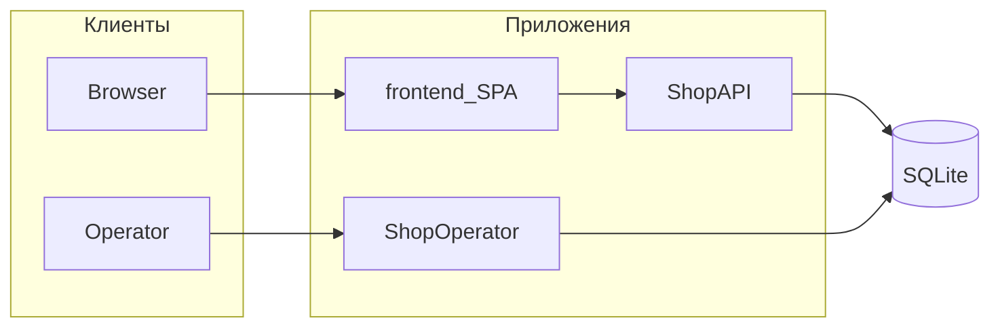
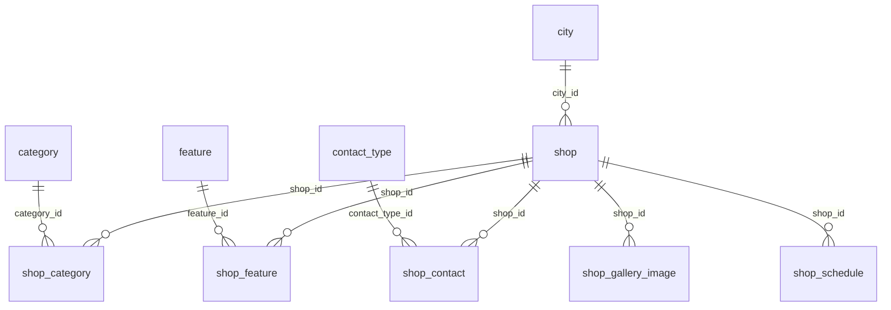

# Документация по реализации

**Дата актуализации: 2026-03-26.**

Документ описывает текущее устройство системы по коду: front office,
backend, back office и deployment-контур.

Связанные документы:
- [DEPLOY](../../infrastructure/DEPLOY.md) — эксплуатационный
  deploy-контур для админов.
- [ADMIN_MANUAL](../manual/ADMIN_MANUAL.md) — практические runbook
  инструкции.

## 1. Архитектура

Backend: **два** Laravel-приложения и **три** composer path-package в
`backend/packages/` (плюс frontend и deploy-обвязка).

**Приложения:**

- `backend/apps/ShopAPI` — публичное HTTP API; в `composer.json`
  подключены пакеты `SchemaDefinition` и `SessionPrune`.
- `backend/apps/ShopOperator` — MoonShine 4 (back office); подключены
  `SchemaDefinition`, `SessionPrune` и `IsThereAnAdmin`.

**Пакеты `backend/packages/`:**

- **`SchemaDefinition`** — миграции, enum имён таблиц и колонок; общий
  источник схемы БД для ShopAPI и ShopOperator.
- **`SessionPrune`** — консольная команда `autoteka:session:prune`
  (сборка мусора сессий Laravel); регистрируется в обоих приложениях.
- **`IsThereAnAdmin`** — консольная команда `autoteka:is-there-an-admin`
  (проверка наличия учётной записи MoonShine по email); используется в
  сценариях setup/seed ShopOperator, в ShopAPI не подключается.

Дополнительно:

- `frontend/` — Vue 3 + Vite SPA для front office;
- `INFRA_ROOT` — docker/nginx/systemd-обвязка, автодеплой и
  техобслуживание.

---

### 1.1. Требования к исполнению разработки LLM-агентом

#### 1.1.1. Спецификация работы LLM-агента

Агент обязан выполнять требования главы "1.1. Требования к разработке
в исполнении LLM-агентом" буквально. Запрещено ослаблять их, заменять
«разумным эквивалентом», трактовать как советы, игнорировать частично
или переставлять обязательные шаги местами, если документ прямо не
допускает такого изменения порядка.

#### 1.1.2. Нормативные слова

Термины ниже имеют жёсткий смысл:

- **обязан** — требование обязательно к исполнению;
- **запрещено** — действие недопустимо;
- **не имеет права** — действие недопустимо до выполнения указанного
  условия;
- **может** — действие допустимо, но не обязательно;
- **если / то** — обязательное условное правило;
- **только если** — исключение, вне которого действие запрещено.

Если формулировка допускает две трактовки, агент обязан выбрать более
строгую трактовку.

### 1.1.3. Требования разработке layout and design

Требования стандартов и практик:

- Web standards W3C:
  - Landmarks (скелет страницы),
  - Заголовки: порядок и структура,
  - Кнопки vs ссылки,
  - Формы: must-have атрибуты;
- Web standards WHATWG;
- WCAG:
  - Контраст текста (SC 1.4.3),
  - Контраст НЕ-текста (SC 1.4.11 Non-text Contrast),
  - Размеры клика/тапа (SC 2.5.8 Target Size),
  - Фокус: видимый, не перекрыт, “достаточно жирный”:
    - (A) Focus Visible (2.4.7),
    - (AA) Focus Not Obscured (2.4.11),
    - (AA) Focus Appearance (2.4.13);
  - Подсказки/tooltip и “контент по ховеру/фокусу” (SC 1.4.13);
- ARIA Authoring Practices (WAI-ARIA):
  - First rule of ARIA,
  - Не делаем `div role=button`, если можно `button`,
  - Modal dialog (паттерн APG);

Подробные соглашения и анти-паттерны: см.
[layout-and-design-standard.md](layout-and-design-standard.md).

Агент обязан разрабатывать решения с соблюдением этих требований.
Запрещено нарушать эти требования, агент может предложить пользователю
разработать решение с нарушением этих требований на этапе планирования
с явным указанием на нарушение.

### 1.1.4. Требования разработке frontend

Стек (сверять с `frontend/package.json`):

- Vue 3.5+ Composition API + Vite 8+;
- Tailwind CSS 4.1+;
- HTML5, CSS (в т.ч. переменные темы в `themes.css`);

Агент обязан разрабатывать решения внутри этого стека. Запрещено
выходить за границы этого стека. Агент может на этапе планирования
предложить пользователю другое общепринятое решение за границами этого
стека с явным указанием на выход за границы.

### 1.1.5. Требования разработке backend

Подходы к разработке:

- TDD сначала пишем тест реализации, потом код реализации;
- OOP объединяем данные и способы их обработки в классы;
- DDD разделяем классы по предметным областям;
- Clean Code разделяем классы (неймспейсы) на слои;
- SOLID;
- KISS код должен быть линейным, элементарным, без самокопирования;

Стек:

- MoonShine 4.8+;
- Laravel 12+;
- PHP 8.4+;
- SQLite 3.5+;

Агент обязан разрабатывать с этими подходами и внутри этого стека.
Запрещено выходить за границы этого стека. Агент может на этапе
планирования предложить пользователю другое общепринятое решение за
границами этого стека с явным указанием на выход за границы.

### 1.1.6. Требования разработке deploy and maintenance

Стек:

- Ubuntu 24+;
- Bash;
- Docker & Docker compose;

Агент обязан разрабатывать внутри этого стека. Запрещено выходить за
границы этого стека. Агент может на этапе планирования предложить
пользователю другое общепринятое решение за границами этого стека с
явным указанием на выход за границы.

### 1.2. Модули и пакеты репозитория

Краткая карта ответственности (границы детализируются в разделах ниже):

| Область           | Путь                                | Назначение                                                                         |
|-------------------|-------------------------------------|------------------------------------------------------------------------------------|
| Front office      | `frontend/`                         | Vue 3 SPA: каталог, карточка магазина, состояние, `HttpApiClient`.                 |
| Публичный API     | `backend/apps/ShopAPI`              | HTTP API для витрины, сериализация JSON, маршруты `/api/v1`.                       |
| Админка           | `backend/apps/ShopOperator`         | MoonShine 4: CRUD домена, медиа, пользователи/роли панели.                         |
| Схема БД          | `backend/packages/SchemaDefinition` | Миграции, enum имён таблиц/колонок; общий источник схемы для обоих приложений.     |
| Сессии            | `backend/packages/SessionPrune`     | Команда `autoteka:session:prune` (GC сессий); подключена в ShopAPI и ShopOperator. |
| Bootstrap админа  | `backend/packages/IsThereAnAdmin`   | Команда `autoteka:is-there-an-admin`; используется в ShopOperator (setup/seed).    |
| Сквозные проверки | `system-tests/`                     | Сценарии поверх нескольких рантаймов (см. `system-tests/README.md`).               |
| Инфраструктура    | `infrastructure/` (`INFRA_ROOT`)    | Docker, nginx, systemd, deploy-скрипты; детали в `infrastructure/DEPLOY.md`.       |
| Агент-воркфлоу    | `scripts/agent/`                    | Обязательные скрипты verify/commit и др. по корневому `AGENTS.md`.                 |



---

## 2. Front office

### 2.1. Основные страницы

- `/` — каталог магазинов;
- `/shop/:code` — карточка магазина.

### 2.2. Основные компоненты

- `TopBar.vue` — фиксированная верхняя панель каталога: кнопка меню
  (burger) и логотип/ссылка на каталог;
- `HamburgerMenu.vue` — off-canvas меню: выбор города и категорий
  (без выбора фишки);
- `CitySelect.vue` — выбор города;
- `CategoryChips.vue` — выбор категорий;
- `CatalogFeatureStickySelect.vue` — липкая панель на странице каталога,
  внутри использует `FeatureSelect.vue` для выбора фишки;
- `FeatureSelect.vue` — селект фишки (на каталоге — только в составе
  sticky-блока);
- `ShopTile.vue` — плитка магазина в сетке каталога;
- `GalleryCarousel.vue` — карусель изображений на карточке магазина;
- `ShopMetaBadges.vue` — отображение названий категорий и фишек;
- `OverscrollOpenLink.vue` — переход на сайт магазина по overscroll на
  карточке;
- `ErrorStatePanel.vue` — сообщение об ошибке загрузки и повтор запроса;
- `UiImage.vue` — обёртка для изображений с обработкой ошибки загрузки.
- `useShopPageLoader.ts` — orchestration загрузки карточки магазина,
  promo-first ветки, таймаутов и retry для transient promo ошибок.

Повторяемая логика страниц вынесена в `frontend/src/composables/`
(например, загрузка списка магазинов каталога и построение контактных строк
на карточке магазина).

Cтатические токены в `themes.css` / `tailwind.css`.

### 2.3. Состояние приложения

Реактивное состояние в `frontend/src/state.ts` (`export const state`):

- `menuOpen` — открыто ли боковое меню;
- `cityCode` — выбранный город;
- `selectedCategoryIds` — выбранные категории;
- `selectedFeatureId` — выбранная фишка;
- `cities`, `categories`, `features` — справочники с API.

Инициализация справочников и гидратация из `localStorage` — в
`initState()` (вызывается из `bootstrap.ts` после загрузки списков).

Ключи `localStorage` (определены в `state.ts`):

- `autoteka_city`
- `autoteka_categories`
- `autoteka_feature`

### 2.4. Источник данных

- через `HttpApiClient` backend API.
- для карточки магазина используются два route:
  - `GET /api/v1/shop/{code}`
  - `GET /api/v1/shop/{code}/promotion`

Базовый URL API задаётся через `VITE_API_BASE_URL`.

По умолчанию:

```text
/api/v1
```

В production deploy-контуре витрина и API обычно отдаются как
same-origin, отдельная настройка CORS для этого сценария не требуется.
В **dev** compose (`infrastructure/runtime/docker-compose.dev.yml`) для
сервиса `web` заданы переменные `CORS_*` — при разнесённых origin
фронта и API CORS может быть нужен; см. шаблоны env в `infrastructure/`.

Promo-first поведение страницы магазина:

- promo может отрисоваться раньше полной карточки магазина;
- ошибка promo не переводит страницу в общий error-state;
- text-only акция рендерится без пустой галереи.

### 2.4.1. Promotion в общей схеме

Новая доменная сущность разбита на две таблицы:

- `promotion` — магазин, код, название, описание, даты начала и
  окончания, флаг публикации;
- `promotion_image` — картинки акции, `original_name`, сортировка и
  флаг публикации.

ShopOperator:

- регистрирует `PromotionResource`;
- создаёт акции из контекста магазина;
- показывает promo-блок на detail магазина;
- вычисляет код акции из `shop.code + '-' + slug(title)`.

ShopAPI:

- отдаёт отдельный promo endpoint;
- сериализует text-only акцию как `galleryImages: []`.

Связанные документы:

- [TESTING](../manual/TESTING.md)
- [ADMIN_MANUAL](../manual/ADMIN_MANUAL.md)
- [../../frontend/README.md](../../frontend/README.md)

### 2.5. Алгоритм каталога

- по городу каталог фильтруется;
- по выбранным категориям и фишке плитки сортируются;
- пользовательские настройки сохраняются между перезагрузками.

### 2.6. Загрузка страницы карточки магазина (`/shop/:code`)

Последовательность в `frontend/src/pages/ShopPage.vue` (функция
`loadShop()`):

1. **Один HTTP-запрос за карточкой магазина:** `GET /api/v1/shop/{code}`
   через `apiClient.getShop(code)` — описание, медиа, координаты,
   списки категорий и фишек и т.д. Без контактов: контакты этим
   ответом **не** возвращаются.

2. **Отдельный HTTP-запрос за контактами:** после успешного ответа по
   магазину вызывается `POST /api/v1/shop/{code}/acceptable-contact-types`
   с телом — массив допустимых кодов типов (в коде страницы задан
   список `ACCEPTABLE_TYPES`: phone, email, telegram, whatsapp,
   address). Ответ — объект «код типа → массив строк значений».

3. Если запрос карточки завершился **404** или другой ошибкой,
   второй запрос **не** выполняется (контакты не загружаются).

4. Ошибка **только** на шаге контактов не отменяет отображение
   карточки: показывается магазин, контакты пустые, выставляется флаг
   ошибки загрузки контактов (`contactsLoadError`), пользователь видит
   предупреждение в блоке контактов.

Таким образом, данные витрины о магазине и список контактов для
отображения приходят **двумя независимыми** запросами к API.

## 3. Backend

### 3.1. Модуль API (`apps/ShopAPI`) — обзор

Laravel подключает файл `routes/api.php` с префиксом **`/api`**, внутри
объявлена группа **`v1`**. Полные пути: **`/api/v1/...`**.

Реализация: `backend/apps/ShopAPI/routes/api.php`, контроллеры в
`app/Http/Controllers/Api/`. Контракт покрыт тестами
`tests/Feature/ApiEndpointsCoverageTest.php`.

### 3.2. Публичный REST API (`/api/v1`)

Общие заголовки запроса: `Accept: application/json`. Для `POST` —
`Content-Type: application/json`.

Ошибки: несуществующие сущности или записи с `is_published = false` для
витрины дают **404** (где в коде используется `firstOrFail()` на отфильтрованном
запросе).

#### `GET /api/v1/city-list`

- **Ответ 200:** JSON-массив объектов (только опубликованные города,
  сортировка `sort`, затем `id`). Число элементов равно числу таких
  городов в БД (в примере ниже — два города).

```json
[
  {
    "id": 1,
    "code": "city-a",
    "title": "City A",
    "sort": 10
  },
  {
    "id": 2,
    "code": "city-b",
    "title": "City B",
    "sort": 20
  }
]
```

#### `GET /api/v1/category-list`

- **Ответ 200:** массив объектов `{ id, title, sort }` для всех
  опубликованных категорий (сколько их есть в БД — столько элементов в
  массиве). Поле `code` в ответ **не** отдаётся.

```json
[
  {
    "id": 1,
    "title": "Запчасти",
    "sort": 1
  },
  {
    "id": 2,
    "title": "Шины и диски",
    "sort": 2
  }
]
```

#### `GET /api/v1/feature-list`

- **Ответ 200:** массив объектов `{ id, title, sort }` для всех
  опубликованных фишек (аналогично категориям по форме полей, отдельный
  справочник).

```json
[
  {
    "id": 10,
    "title": "Свой сервис",
    "sort": 1
  },
  {
    "id": 11,
    "title": "Парковка",
    "sort": 2
  }
]
```

#### `GET /api/v1/city/{code}`

- **Параметр пути:** `code` — строковый код города (`city.code`).
- **Ответ 200:** объект каталога города.

```json
{
  "city": {
    "id": 1,
    "code": "nsk",
    "title": "Новосибирск",
    "sort": 1
  },
  "items": [
    {
      "id": 101,
      "code": "shop-alpha",
      "title": "Автоцентр Альфа",
      "sort": 1,
      "cityId": 1,
      "thumbUrl": "https://cdn.example.com/storage/shops/thumbs/alpha.webp",
      "categoryIds": [
        1,
        2
      ],
      "featureIds": [
        10,
        11
      ]
    },
    {
      "id": 102,
      "code": "shop-beta",
      "title": "Магазин Бета",
      "sort": 2,
      "cityId": 1,
      "thumbUrl": null,
      "categoryIds": [
        1
      ],
      "featureIds": [
        10
      ]
    }
  ]
}
```

В массиве `items` — по одному объекту на каждый опубликованный магазин
данного города; у каждого магазина `categoryIds` и `featureIds` — это
массивы идентификаторов (в примере показаны варианты с одним и с двумя
значениями). Поле `thumbUrl` может быть строкой с абсолютным URL или
`null`, если миниатюра не задана.

В выборку попадают только магазины с `shop.is_published = true`, город с
`is_published = true`. В `categoryIds` / `featureIds` — только связи, у
которых опубликованы и справочник (`category` / `feature`), и строка связи
(pivot `is_published` на `shop_category` / `shop_feature`). `thumbUrl` —
абсолютный URL через диск медиа (`config('autoteka.media.disk')`).

#### `GET /api/v1/shop/{code}`

- **Параметр пути:** `code` — код магазина (`shop.code`).

- **Ответ 200:** детальная карточка (только опубликованный магазин). Ниже
  пример со **всеми** полями ответа; массивы, которые в данных могут
  содержать несколько элементов, показаны **не менее чем с двумя**
  значениями. Числа и URL иллюстративные.

```json
{
  "id": 101,
  "code": "shop-alpha",
  "title": "Автоцентр Альфа",
  "sort": 1,
  "cityId": 1,
  "description": "Полное текстовое описание магазина для витрины: ассортимент, условия доставки, как добраться.",
  "siteUrl": "https://shop-alpha.example.com/",
  "slogan": "Запчасти и сервис без выходных",
  "latitude": 55.0287,
  "longitude": 82.9235,
  "scheduleNote": "Пн–Вс 9:00–21:00, без перерыва",
  "thumbUrl": "https://cdn.example.com/storage/shops/thumbs/alpha.webp",
  "galleryImages": [
    "https://cdn.example.com/storage/shops/gallery/showroom-1.webp",
    "https://cdn.example.com/storage/shops/gallery/parking-2.webp",
    "https://cdn.example.com/storage/shops/gallery/parts-3.webp"
  ],
  "categoryIds": [
    1,
    2
  ],
  "featureIds": [
    10,
    11
  ]
}
```

- `galleryImages` — массив строк с **абсолютными URL** готовых файлов
  галереи (не путей в БД); порядок соответствует сортировке в API.
  Если опубликованных изображений нет, приходит пустой массив `[]`.
- `thumbUrl` — URL миниатюры или `null`, если файл миниатюры не задан.
- `description`, `siteUrl`, `slogan`, `scheduleNote` — строки; числовые
  поля широты/долготы могут быть `null` в БД, в JSON тогда придут
  `null` (в примере показаны заполненные координаты).
- Правила отбора `categoryIds` и `featureIds` — те же, что в каталоге
  города (опубликованные справочники и pivot).

**Расписание по дням** (`shop_schedule`): строки интервалов в этот JSON
**не** входят. В `ShopShowController` связь `schedules` подгружается
через `with()`, но в массив для ответа не попадает (в тестах проверяется
отсутствие отдельного поля вроде `workHours`). Текст о режиме на витрине
задаётся только полем **`scheduleNote`** (колонка `shop.schedule_note`).

#### `POST /api/v1/shop/{code}/acceptable-contact-types`

- **Параметр пути:** `code` магазина.
- **Тело:** JSON **массив строк** — коды типов контактов (`contact_type.code`).
  Элементы, не являющиеся строками, отбрасываются. Пустой массив допустим.
  Объект вида `{"codes":["phone"]}` **не** интерпретируется как список кодов;
  в этом случае ответ будет пустым объектом (см. тест).

Пример запроса:

```json
[
  "phone",
  "",
  "unknown-type",
  "email",
  123
]
```

Пример ответа **200** (у одного типа может быть несколько значений —
несколько телефонов, несколько адресов e-mail и т.д.):

```json
{
  "phone": [
    "+7 900 000 00 00",
    "+7 383 000 00 01"
  ],
  "email": [
    "mail@example.com",
    "info@example.com"
  ]
}
```

Ключи объекта — коды типов (`contact_type.code`); значения — массивы
строк контактов из опубликованных строк `shop_contact` с
опубликованным типом. Если по типу нет подходящих записей, ключа может
не быть. Пустой разрешённый список кодов в запросе даёт `{}`.

### 3.3. Контракты DTO и `HttpApiClient`

Клиент `frontend/src/api/HttpApiClient.ts` задаёт базовый URL из
`VITE_API_BASE_URL` (обычно заканчивается на `/api/v1`) и вызывает пути вида
`/city-list`, `/shop/{code}` относительно этого префикса.

Сводка ожиданий клиента:

- `city-list` — города; на фронте в модель города попадают `code`, `title`,
  `sort` (поле `id` с сервера может не использоваться в типах UI).
- `category-list` / `feature-list` — `id`, `title`, `sort`.
- `city/{code}` — `city` + `items` (краткие карточки).
- `shop/{code}` — полная карточка, см. §3.2.
- `acceptable-contact-types` — объект «код типа → массив значений».

На странице карточки магазина клиент сначала запрашивает `shop/{code}`,
затем отдельно — `acceptable-contact-types` (см. §2.6).

Идентификаторы `number|string` на фронте нормализуются к `string`.

### 3.4. Модуль админки (`apps/ShopOperator`)

MoonShine-панель регистрирует ресурсы в
`app/Providers/MoonShineServiceProvider.php`. Пункты бокового меню задаются в
`app/MoonShine/Layouts/MoonShineLayout.php`:

1. Группа **«Справочники»:** `CityResource`, `CategoryResource`,
   `FeatureResource`, `ContactTypeResource` (в этом порядке).
2. Группа **«Данные»:** `ShopResource`.
3. Далее меню родительского layout (пользователи и роли MoonShine:
   `MoonShineUserResource`, `MoonShineUserRoleResource`).

Таблица ресурсов и таблиц БД:

| Ресурс MoonShine            | Таблица / назначение                                                   |
|-----------------------------|------------------------------------------------------------------------|
| `CityResource`              | `city` — города каталога                                               |
| `CategoryResource`          | `category`                                                             |
| `FeatureResource`           | `feature`                                                              |
| `ContactTypeResource`       | `contact_type`                                                         |
| `ShopResource`              | `shop` — карточка магазина; сохранение через `SaveShopResourceHandler` |
| `MoonShineUserResource`     | `moonshine_users` — вход в панель                                      |
| `MoonShineUserRoleResource` | `moonshine_user_roles`                                                 |

#### Связь `shop` с городом и таблицами `shop_*`

- **`city` → `shop`:** связь **1:N**, внешний ключ `shop.city_id` → `city.id`
  (`ON DELETE` ограничен справочником `city`).
- **`shop` ↔ `category`:** **N:M** через **`shop_category`**
  (`shop_id`, `category_id`, уникальная пара; колонка **`is_published`** на
  связи — видимость пары на витрине).
- **`shop` ↔ `feature`:** **N:M** через **`shop_feature`** (аналогично, с
  **`is_published`** на pivot).
- **`shop` → `shop_contact`:** **1:N**; каждая строка ссылается на
  `contact_type_id` → `contact_type`.
- **`shop` → `shop_gallery_image`:** **1:N** (файлы галереи, сортировка,
  `is_published`).
- **`shop` → `shop_schedule`:** **1:N** (день недели, интервал времени,
  `is_published`).



### 3.5. Общие данные и модели

Ключевые модели домена (таблицы Автотеки):

- `City`, `Category`, `Feature`, `ContactType`
- `Shop`, `ShopContact`, `ShopGalleryImage`, `ShopSchedule`

Дополнительно в схеме БД:

- таблица `users` (миграция Laravel по умолчанию в
  `SchemaDefinition`; в коде Автотеки отдельная модель `User` может не
  использоваться);
- MoonShine: `moonshine_users`, `moonshine_user_roles`.

### 3.6. Виртуальные поля Shop в back office

Поля **`category_links`**, **`feature_links`**, **`contact_entries`**,
**`gallery_entries`**, **`schedule_entries`** в модели `Shop` — вычисляемые
атрибуты для формы MoonShine (не отдельные колонки таблицы `shop`). Их
содержимое отражает pivot/дочерние строки:

- `category_links` / `feature_links` — пары с `is_published` на связи;
- `contact_entries`, `gallery_entries`, `schedule_entries` — строки
  `shop_contact`, `shop_gallery_image`, `shop_schedule`.

Колонка **`schedule_note`** — обычное поле таблицы **`shop`** (текст заметки
о режиме для API и формы админки).

### 3.7. Полезные backend-concerns

- генерация стабильного `code` (trait/concern на модели);
- нормализация `siteUrl` при сохранении;
- отображение интервалов `shop_schedule` в админке:
  `ShopOperator/app/Support/Shop/FormatsWorkHours.php`;
- вспомогательные колонки; имена таблиц на моделях — свойство `$table` со
  значением из enum `TableName` пакета SchemaDefinition.

## 4. Runtime-контур в коде

### 4.1. Compose

Переменная **`INFRA_ROOT`** указывает на каталог `infrastructure/` в
репозитории (см. `DEPLOY.md`).

Production (`$INFRA_ROOT/runtime/docker-compose.yml`):

- `php` — образ backend FPM; имя контейнера по умолчанию
  `${RUN_INSTANCE:-autoteka}-php` (часто `autoteka-php`);
- `web` — nginx + собранный frontend + proxy; контейнер по умолчанию
  `…-http`;
- volume: `database`, `storage`, admin `public/vendor` (см. файл).

Dev (`$INFRA_ROOT/runtime/docker-compose.dev.yml`):

- `php` — dev backend, `container_name` по умолчанию `…-dev-php`,
  `working_dir` `/workspace/backend`;
- `frontend` — Vite, `…-dev-frontend`, `/workspace/frontend`;
- `web` — dev nginx, `…-dev-web`, прокси к frontend и API.

### 4.2. Dockerfile и entrypoint пути

- PHP образ: `$INFRA_ROOT/runtime/docker/php/Dockerfile` (targets:
  `dev`, `prod`).
- Dev nginx: `$INFRA_ROOT/runtime/docker/dev/nginx/Dockerfile`.
- Prod nginx: `$INFRA_ROOT/runtime/docker/prod/nginx/Dockerfile`.
- Entry points PHP:
  - `$INFRA_ROOT/runtime/docker/php/dev-entrypoint.sh`
  - `$INFRA_ROOT/runtime/docker/php/prod-entrypoint.sh`

Оба PHP-entrypoint подготавливают окружение для двух приложений
`apps/ShopAPI` и `apps/ShopOperator` (env, cache/bootstrap каталоги,
storage symlink).

Для `prod-docker` исходники и конфигурация baked-in в образах, поэтому
после любого изменения в исходниках или конфигурации требуется
пересборка production-образов и rollout новых контейнеров.

### 4.3. Лог-файлы backend модулей

- `backend/apps/ShopAPI/storage/logs/laravel.log`
- `backend/apps/ShopOperator/storage/logs/laravel.log`

В runtime-контуре эти пути соответствуют:

- `/var/www/backend/apps/ShopAPI/storage/logs/laravel.log`
- `/var/www/backend/apps/ShopOperator/storage/logs/laravel.log`

MoonShine media и shop-изображения фактически читаются из корня
`backend/storage/app/public` (runtime:
`/var/www/backend/storage/app/public`). Поэтому для инфраструктурного
backup покрывается весь корень `backend/storage` (ops-механика описана
в [DEPLOY](../../infrastructure/DEPLOY.md)).

## 5. Deploy и operations (границы документа)

Низкоуровневые сценарии развёртывания, systemd/timers, backup/restore,
watchdog/maintenance и серверные runbook-процедуры описаны в
`infrastructure/DEPLOY.md` и `docs/manual/ADMIN_MANUAL.md`.

Здесь они упоминаются только как граница ответственности.

## 6. Служебные процессы в коде

Код deploy-контура разложен по областям ответственности: `bootstrap`,
`runtime`, `repair`, `maintenance`, `observability`, `lib`.

Файлы systemd units и timers находятся в репозитории в
`$INFRA_ROOT/runtime/systemd/`,
`$INFRA_ROOT/observability/infrastructure/systemd/` и
`$INFRA_ROOT/maintenance/systemd/`. Установка на хост выполняется
скриптом **`$INFRA_ROOT/bootstrap/install.sh`** (см. `DEPLOY.md`), который
разворачивает units в systemd:

- `$INFRA_ROOT/runtime/systemd/autoteka.service` — основной unit для
  запуска контейнеров через `docker compose up -d`
- `$INFRA_ROOT/runtime/systemd/watch-changes.service` — unit для
  автодеплоя, запускает `watch-changes.sh`
- `$INFRA_ROOT/runtime/systemd/watch-changes.timer` — timer для автодеплоя
  (каждые 5 минут)
- `$INFRA_ROOT/observability/infrastructure/systemd/server-watchdog.service`
  — unit для watchdog-проверок
- `$INFRA_ROOT/observability/infrastructure/systemd/server-watchdog.timer`
  — timer для watchdog (каждые 2 минуты)
- `$INFRA_ROOT/maintenance/systemd/server-maintenance.service` — unit для
  maintenance-операций
- `$INFRA_ROOT/maintenance/systemd/server-maintenance.timer` — timer для
  maintenance (ежедневно в 03:15)

`watch-changes.service` запускает `watch-changes.sh`, а не rollout
напрямую: watcher обновляет рабочую копию и стартует новый процесс
`deploy.sh` для раскатки текущего `HEAD`.

Подробности о параметрах units и timers см.
[DEPLOY §6.1](../../infrastructure/DEPLOY.md#61-systemd-и-timers).

### 6.1. Env и source of truth

- `/etc/autoteka/options.env` — источник `AUTOTEKA_ROOT`, `INFRA_ROOT`,
  `GIT_BRANCH`, `GIT_REMOTE`, `HTTP_BIND_IP`, `HTTP_PORT`. Скрипты берут пути только из env или
  аргументов, не из расположения (см. [DEPLOY § Контракты
  путей](../../infrastructure/DEPLOY.md#контракты-путей)).
- Файл по `TELEGRAM_ENV_FILE` — optional Telegram secrets

## 7. Проверки

### Frontend

Из каталога `frontend/` (см. `frontend/README.md` и `docs/manual/TESTING.md`):

- `npm run test` или `npm run test:unit` — unit (Vitest);
- `npm run test:unit:parallel` — unit с параллельным пулом;
- `npm run test:ui:mock` — Playwright против mock/UI;
- `npm run test:api:online` — интеграция с реальным API (нужен базовый URL);
- `npm run test:e2e` — Playwright e2e.

### Backend (модульно)

- `cd backend/apps/ShopAPI && php artisan test` (или `composer test:parallel`
  из каталога приложения);
- `cd backend/apps/ShopOperator && php artisan test` (аналогично);
- миграции и типичный seed: рабочая копия `backend/apps/ShopOperator`
  (см. `example.env`, сиды в `database/seeders`).

### Monorepo (корень репозитория)

- `npm run lint` — обёртка над `lint/lint.sh` (нужен Bash, см. корневой
  `package.json`);
- `npm run test:backend:parallel` — параллельно тесты ShopAPI и
  ShopOperator.

## 8. Известные ограничения

- В репозитории нет полноценного CI-пайплайна, который автоматически
  запускает все frontend/backend/deploy проверки.
- Часть пользовательского поведения сохраняется локально в браузере,
  поэтому диагностика UI должна учитывать localStorage.
- Deployment-контур ориентирован на Debian/Ubuntu и systemd.

## Заметки по текущей вёрстке front office

- `App.vue`: для маршрута `catalog` показываются `TopBar` и
  `HamburgerMenu`; для `shop` — только контент страницы (кнопка «назад»
  на самой `ShopPage`).
- `TopBar.vue`: слева burger, по центру бренд (`RouterLink` на каталог);
  отдельного заголовка страницы в панели нет.
- `HamburgerMenu.vue`: только город и категории; фишка не в меню.
- `CatalogPage.vue`: сетка `ShopTile`, затем `CatalogFeatureStickySelect`
  (липкий блок с `FeatureSelect`, `state.selectedFeatureId`).
- `ShopTile.vue`: типографика и сетка плитки задаются в `tailwind.css`
  (в т.ч. `cqw`/`cqh` где уместно).
- `ShopPage.vue`: блок hero (назад, логотип, `GalleryCarousel`), под
  галереей при наличии — текст `scheduleNote`; далее секции описание,
  контакты, затем `ShopMetaBadges` (категории/фишки); внизу
  `OverscrollOpenLink` при наличии URL сайта.
- Тема: фиксированные CSS-переменные в `themes.css` и утилиты в
  `tailwind.css` (в т.ч. классы `catalog-feature-sticky-*` для sticky
  выбора фишки); редактора темы во фронте нет.
