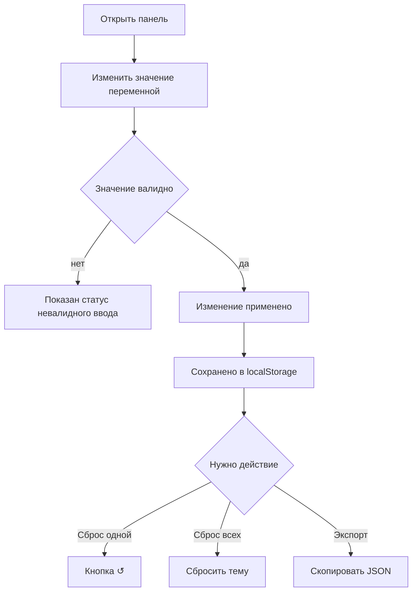
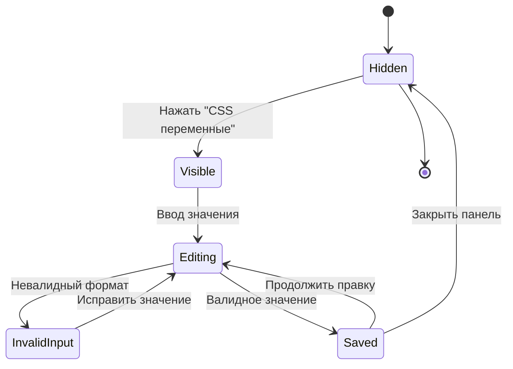

# Руководство пользователя: редактор темы оформления

**Дата актуализации: 2026-03-05.**

Документ описывает, как пользоваться редактором CSS‑переменных в
интерфейсе приложения.

---

## 1. Что это

Редактор темы — это встроенная панель, которая позволяет:

- менять значения CSS‑переменных активной темы;
- видеть изменения сразу в интерфейсе;
- сохранять настройки в `localStorage`.

---

## 2. Как включить редактор

### 2.1. В dev-среде

Обычно редактор доступен автоматически.

### 2.2. В prod/stage

Откройте DevTools Console и выполните:

```js
localStorage.setItem("autoteka_theme_editor_enabled", "true");
location.reload();
```

Чтобы скрыть редактор:

```js
localStorage.setItem("autoteka_theme_editor_enabled", "false");
location.reload();
```

---

## 3. Где находится редактор

- Кнопка `CSS переменные` находится в верхней панели (`TopBar`).
- Редактор показывается на страницах:
  - каталог (`/`);
  - карточка магазина (`/shop/:id`).
- На мобильных брейкпоинтах редактор скрыт.

---

## 4. Базовый сценарий использования

1. Нажмите кнопку `CSS переменные`.
2. В панели выберите переменную и введите новое значение.
3. Если значение валидно, интерфейс обновится сразу.
4. Для сброса одной переменной нажмите `↺`.
5. Для сброса всех overrides текущей темы нажмите `Сбросить тему`.
6. Для копирования текущего набора нажмите `Скопировать JSON`.



---

## 5. Поведение при смене темы

- Overrides хранятся отдельно для каждой темы.
- При переключении темы загружается её собственный набор значений.
- Значения предыдущей темы не должны «протекать» в следующую.



---

## 6. Частые проблемы и решения

### 6.1. Кнопка редактора не видна

- Проверьте ширину экрана (на мобильном скрыто).
- Проверьте `localStorage.autoteka_theme_editor_enabled`.
- Убедитесь, что открыта страница `/` или `/shop/:id`.

### 6.2. Значение не применяется

- Проверьте формат значения:
  - цвета: `oklch(...)`, `#hex`, `rgb(...)`;
  - проценты: `8%`, `12%`;
  - коэффициенты: `1.1`, `0.92`.
- Если поле отмечено как невалидное, исправьте формат.

### 6.3. Нужно полностью очистить состояние

Выполните в Console:

```js
localStorage.removeItem("autoteka_theme_overrides_v1");
location.reload();
```

---

## 7. Мини-чеклист QA

1. Кнопка редактора доступна на desktop/tablet на `/` и `/shop/:id`.
2. Ввод валидного значения мгновенно меняет UI.
3. `↺` откатывает одну переменную.
4. `Сбросить тему` удаляет все overrides текущей темы.
5. После reload значения сохраняются.
6. После смены темы подтягивается отдельный набор overrides.
