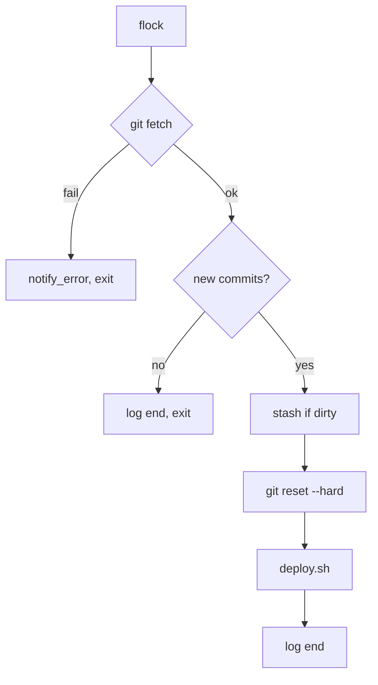

# DEPLOY

Документ описывает infra-контур проекта.

## Контракты путей

- `AUTOTEKA_ROOT` — корень приложения.
- `INFRA_ROOT` — корень infra-скриптов и infra-ресурсов.
- Эти пути считаются независимыми.
- Infra-пути строятся только от `INFRA_ROOT`.
- Пути приложения строятся только от `AUTOTEKA_ROOT`.
- Нельзя выводить `AUTOTEKA_ROOT` из `INFRA_ROOT` и нельзя выводить
  `INFRA_ROOT` из `AUTOTEKA_ROOT`.

### Откуда берутся INFRA_ROOT и AUTOTEKA_ROOT

Значения задаются **только** одним из способов:

1. Переменные окружения (например, `export INFRA_ROOT=...`).
2. Аргументы запуска (если скрипт поддерживает `--infra-root=` и `--autoteka-root=`).
3. Загрузка из файла (например, `source prod.env`).

При пустых или
относительных путях скрипт завершается с кодом 2 и выводит примеры запуска.

Пример для install.sh (переменные окружения):

```bash
export INFRA_ROOT=/opt/vue-app/infrastructure
export AUTOTEKA_ROOT=/opt/vue-app
sudo ./infrastructure/bootstrap/install.sh
```

или загрузка из файла (prod.env содержит INFRA_ROOT и AUTOTEKA_ROOT):

```bash
set -a
source ./infrastructure/prod.env
set +a
sudo -E ./infrastructure/bootstrap/install.sh
```

или аргументы:

```bash
sudo ./infrastructure/bootstrap/install.sh --infra-root=/opt/vue-app/infrastructure --autoteka-root=/opt/vue-app
```

## Основные файлы

- `$INFRA_ROOT/prod.env` — шаблон переменных для production (включая `AUTOTEKA_OPTIONS_FILE`, `AUTOTEKA_LOG_DIR`).
- `$INFRA_ROOT/dev.env` — шаблон переменных для dev-среды.
- `$INFRA_ROOT/.env` — создаётся из prod.env перед install, используется только install.sh.
  После успешной установки install.sh перемещает .env в `$INFRA_ROOT/backup.env`.
  Для повторного install: `cp backup.env .env`.
- `$AUTOTEKA_OPTIONS_FILE` (обычно `/etc/autoteka/options.env`) — рабочий конфиг после установки;
  все изменения вносить в options.env.
- Файл по пути `TELEGRAM_ENV_FILE` — `TELEGRAM_TOKEN`, `TELEGRAM_CHAT`.
  Путь задаётся в .env, install.sh копирует его в options.env.
  Каждое уведомление содержит hash и subject в блоке version.
- `$INFRA_ROOT/bootstrap/` — install/uninstall и host-конфиги.
- `$INFRA_ROOT/runtime/` — compose, rollout и watch-changes.
- `$INFRA_ROOT/repair/` — сценарии починки runtime и infra.
- `$INFRA_ROOT/maintenance/` — backup, restore и периодическое
  обслуживание.
- `$INFRA_ROOT/observability/` — watchdog и экспорт metrics.
- `$INFRA_ROOT/lib/` — общие shell-библиотеки.

### 5. Настройки окружения

- `AUTOTEKA_OPTIONS_FILE` — путь к options.env (в prod.env: `/etc/autoteka/options.env`).
- options.env — `AUTOTEKA_ROOT`, `INFRA_ROOT`, `AUTOTEKA_LOG_DIR`, `TELEGRAM_LOCK_DIR`,
  `BRANCH`, `REMOTE`, `HTTP_PORT`. Скрипты берут пути только из env или аргументов.
- Файл по пути `TELEGRAM_ENV_FILE` — `TELEGRAM_TOKEN`, `TELEGRAM_CHAT`
  (см. выше в «Основные файлы»).

### 5.2. Telegram env

Опции Telegram (`TELEGRAM_ENV_FILE`, `TELEGRAM_TOKEN`, `TELEGRAM_CHAT`)
задаются в `$INFRA_ROOT/.env` перед install. install.sh копирует шаблон
`bootstrap/config/telegram.example.env` по пути `TELEGRAM_ENV_FILE` и
переписывает туда значения из .env. В `options.env` — `TELEGRAM_ENV_FILE`
(путь задаётся в .env). Лог Telegram: `$AUTOTEKA_LOG_DIR/telegram.log`.

`TELEGRAM_ENV_FILE` опционален: если не задан, watchdog, watch-changes и
maintenance работают без Telegram-уведомлений.

### 5.3. Backend env

`backend/.env` — Laravel-конфиг. Создаётся из `backend/example.env` при первом
запуске. Подробности — [ADMIN_MANUAL §6.2](../docs/manual/ADMIN_MANUAL.md#62-backend).

### 6.1. Systemd и timers

После install.sh создаются systemd-юниты: `autoteka.service`,
`watch-changes.timer`, `server-watchdog.timer`, `server-maintenance.timer`.
Таймеры запускают скрипты из `$INFRA_ROOT`. При изменении `$INFRA_ROOT` или
путей к скриптам требуется обновление unit-файлов — см.
[ADMIN_MANUAL: инструкция по обновлению](../docs/manual/ADMIN_MANUAL.md#инструкция-по-обновлению-при-изменении-infra_root).

## Команды

- `autoteka up` — поднять production runtime.
- `autoteka down` — остановить runtime.
- `autoteka deploy` — раскатить текущий `HEAD`.
- `autoteka watch-changes` — проверить remote и при необходимости
  запустить rollout.
- `autoteka watchdog` — health-check и bounded auto-remediation.
- `autoteka repair-runtime` — тяжёлая починка backend runtime.
- `autoteka repair-health <domain>` — точечная починка домена.
- `autoteka repair-infra` — восстановить таймеры и infra-state.
- `autoteka maintenance` — периодическое обслуживание.
- `autoteka backup` — backup host-конфигов, env и данных.
- `autoteka backup-storage` — отдельный storage/database backup.
- `autoteka restore <archive>` — restore конфигов и данных.
- `autoteka uninstall <mode>` — удаление установленного контура.

При прямом запуске скриптов `INFRA_ROOT` и `AUTOTEKA_ROOT` должны быть уже
заданы (env или options.env). Пример:

```bash
export INFRA_ROOT=/opt/vue-app/infrastructure
export AUTOTEKA_ROOT=/opt/vue-app
"$INFRA_ROOT"/bootstrap/install.sh
"$INFRA_ROOT"/maintenance/backup.sh
"$INFRA_ROOT"/runtime/deploy.sh
```

Скрипты backup, restore и др. поддерживают аргументы `--infra-root=` и
`--autoteka-root=` для переопределения.

## Test runtime и изоляция

- Обычный dev/runtime может работать по основной SQLite.
- Для изолированной копии используйте отдельный
  `AUTOTEKA_RUNTIME_INSTANCE`, чтобы контейнеры и volumes не делились с
  основной копией.
- Для изолированной копии используйте отдельный `DB_DATABASE`, обычно
  `../../database/database.test.sqlite`.
- `migrate --force` не очищает БД; он применяет обычные миграции к
  выбранной базе.
- `AdminUserSeeder` должен запускаться только после проверки наличия
  admin-учётки через `autoteka:is-there-an-admin`.

## Runtime и сборка контейнеров

- Compose-файлы находятся в `$INFRA_ROOT/runtime/`.
- `build.context` указывает на `AUTOTEKA_ROOT`, потому что backend и
  frontend собираются из приложения.
- `dockerfile` указывает на файл внутри `INFRA_ROOT`.
- Дополнительный build context `infra` пробрасывает в Docker build
  шаблоны nginx/php и entrypoint-скрипты из `INFRA_ROOT`, чтобы сборка
  не зависела от имени каталога.
- Metrics монтируются из
  `$INFRA_ROOT/observability/application/metrics`.

Production:

Стек задаётся через [`lib/runtime-compose.sh`](lib/runtime-compose.sh): базовый файл
`runtime/docker-compose.yml`, при `DEPLOY_ENV=prod` в options.env (или `.env` на этапе install)
дополнительно подключается `runtime/docker-compose.prod.yml`. Руками, эквивалентно:

```bash
# при DEPLOY_ENV=prod
docker compose \
  -f "$INFRA_ROOT"/runtime/docker-compose.yml \
  -f "$INFRA_ROOT"/runtime/docker-compose.prod.yml \
  ps
docker compose \
  -f "$INFRA_ROOT"/runtime/docker-compose.yml \
  -f "$INFRA_ROOT"/runtime/docker-compose.prod.yml \
  logs -f web
docker compose \
  -f "$INFRA_ROOT"/runtime/docker-compose.yml \
  -f "$INFRA_ROOT"/runtime/docker-compose.prod.yml \
  logs -f php
```

При `DEPLOY_ENV` не равном `prod` второй `-f` не используется. Для типовых операций удобнее
`autoteka up` / `autoteka down` (тот же набор файлов).

Dev:

```bash
docker compose \
  -f "$INFRA_ROOT"/runtime/docker-compose.dev.yml \
  -f "$INFRA_ROOT"/runtime/docker-compose.dev.target-dev.yml \
  up --build -d
```

## Подготовка к развёртыванию

### 3. Что делает install.sh

install.sh копирует .env в `/etc/autoteka/options.env`, создаёт systemd-юниты,
logrotate-правила, каталоги для логов и metrics. Подробности по диагностике и
починке — [ADMIN_MANUAL](../docs/manual/ADMIN_MANUAL.md).

### 4. Развёртывание с нуля

Перед первым запуском install.sh:

1. Задайте `INFRA_ROOT` и `AUTOTEKA_ROOT` 
   (env, аргументы или загрузка из файла).
2. Создайте .env из prod.env:
   - `export INFRA_ROOT=/opt/autoteka/infrastructure`
   - `export AUTOTEKA_ROOT=/opt/autoteka`
   - `cp -n "$INFRA_ROOT/prod.env" "$INFRA_ROOT/.env"`
3. Отредактируйте .env при необходимости.
4. Запустите install. Варианты:
   Через env:
   `sudo ./infrastructure/bootstrap/install.sh` 
   (после export INFRA_ROOT и AUTOTEKA_ROOT).

   Через загрузку из файла:
   `set -a \
   && source ./infrastructure/prod.env \
   && set +a \
   && sudo -E ./infrastructure/bootstrap/install.sh`

   Через аргументы:
   `sudo ./infrastructure/bootstrap/install.sh --infra-root=/opt/vue-app/infrastructure --autoteka-root=/opt/vue-app`

install.sh скопирует .env в /etc/autoteka/options.env. После установки
изменяйте значения только в /etc/autoteka/options.env.

## Backup и restore

### 8. Техническое обслуживание

`autoteka maintenance` — периодическая очистка (apt, journalctl, docker prune),
backup, исправление прав logrotate. Запускается таймером `server-maintenance.timer`.

### 9. Удаление установленной системы

`autoteka uninstall <mode>` — удаление systemd-юнитов, logrotate, логов.
Режимы: `soft`, `purge`, `nuke`. Подробности — [ADMIN_MANUAL](../docs/manual/ADMIN_MANUAL.md).

### 10. Резервное копирование и восстановление deploy-настроек

`autoteka backup` создаёт до трёх архивов по glob-правилам из
`$INFRA_ROOT/maintenance/config/backup-rules-*.txt`:

- `autoteka-backup-root-*.tar.gz` — пути относительно `/`;
- `autoteka-backup-autoteka-*.tar.gz` — пути относительно `$AUTOTEKA_ROOT`;
- `autoteka-backup-infra-*.tar.gz` — пути относительно `$INFRA_ROOT`.

Правила: include — `pattern`, exclude — `!pattern`. Файлы `backup-rules-*.txt`
исключены из git; в репозитории есть `backup-rules-*.example.txt`. При первом
`install.sh` рабочие файлы создаются из `.example.txt`, если их ещё нет.

При создании backup архивы старше `STORAGE_BACKUP_RETENTION_DAYS` дней (из
`/etc/autoteka/options.env`, по умолчанию 7) удаляются.

`autoteka restore` принимает 1–3 архива через `--archive-root`, `--archive-autoteka`,
`--archive-infra`. Перед развёртыванием останавливает таймеры, после — запускает.
Очищает runtime health-state.

Дополнительно: `autoteka timers-stop`, `autoteka timers-start`.

## Обновление старой установки

Новая версия не выполняет автоматическую миграцию старой установки.
Пошаговый сценарий обновления оформляется отдельной инструкцией в
`tasks/`.

## Логика работы скриптов

### install.sh

Загружает `$INFRA_ROOT/.env`, устанавливает пакеты (docker, logrotate, 
fail2ban), создаёт `/etc/autoteka/options.env` и файл 
по `TELEGRAM_ENV_FILE`, создаёт `backup-rules-*.txt` из `.example.txt`
при первом развёртывании (если их ещё нет), копирует systemd-юниты, 
запускает deploy flow (сборка, compose up), включает таймеры.

### watch-changes.sh



### server-watchdog.sh

Проверяет health-домены (nginx, php, backend, admin, api) по порогам.
При сбое: DEGRADED → автопочинка → cooldown → manual_required.
Пишет метрики в `$AUTOTEKA_LOG_DIR/server-metrics.log`, вызывает
`metrics-export.sh` при успешной проверке.

### metrics-export.sh

Читает `$AUTOTEKA_LOG_DIR/server-metrics.log`, конвертирует в JSON, пишет в
`$INFRA_ROOT/observability/application/metrics/data.json`. Nginx раздаёт
его по `/metrics/data.json`.

### repair-скрипты и diagnose

- `diagnose` — общая картина (контейнеры, таймеры, health, логи), рекомендации.
- `repair-health <domain>` — перезапуск контейнеров, проверка health.
- `repair-runtime` — полная пересборка и smoke-check.
- `repair-infra` — перезапуск таймеров, сброс watchdog state.
- `health-reset <target>` — сброс incident state и Telegram lock'ов.

Подробные сценарии диагностики — [ADMIN_MANUAL §12](../docs/manual/ADMIN_MANUAL.md#12-пошаговая-диагностика).

## Диагностика

- `journalctl -u autoteka.service -u watch-changes.service`
- `journalctl -u server-watchdog.service -u server-maintenance.service`
- `tail -n 100 $AUTOTEKA_LOG_DIR/autoteka-deploy.log`
- `tail -n 100 $AUTOTEKA_LOG_DIR/server-watchdog.log`
- `tail -n 100 $AUTOTEKA_LOG_DIR/server-maintenance.log`
- `tail -n 100 $AUTOTEKA_LOG_DIR/telegram.log`

## Верификация

- Infra-изменения проверяются через `scripts/agent/verify.ps1`.
- Быстрый обязательный gate:

```powershell
scripts/agent/verify.ps1 -Staged -LintMode check -TestProfile minimal
```

- При необходимости отдельно прогоняются repo test-cases, которые
  проверяют infra-документы и shell-скрипты.
